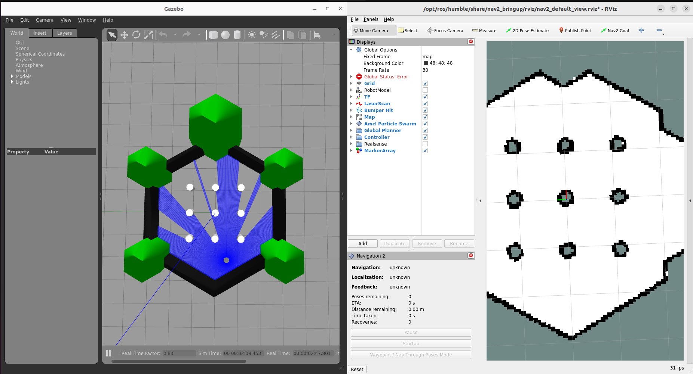
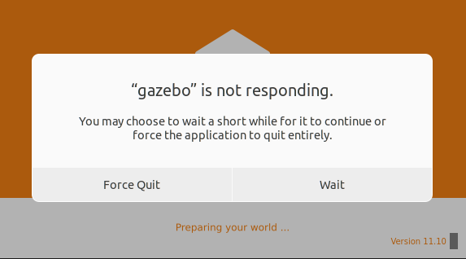
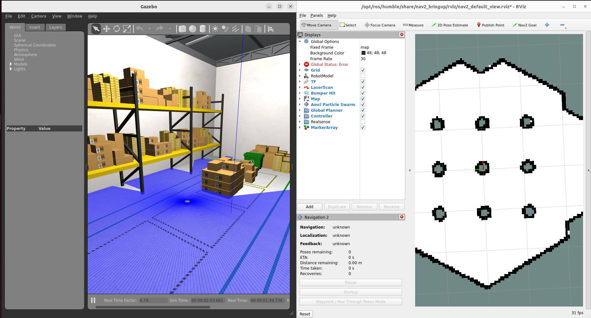
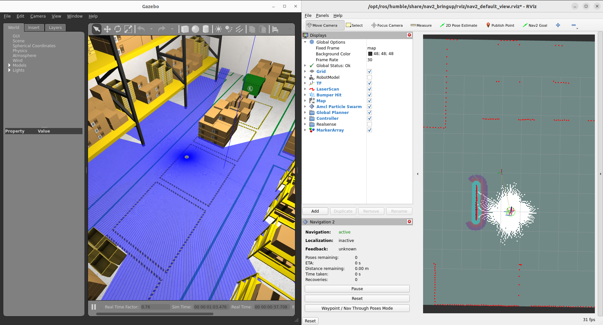
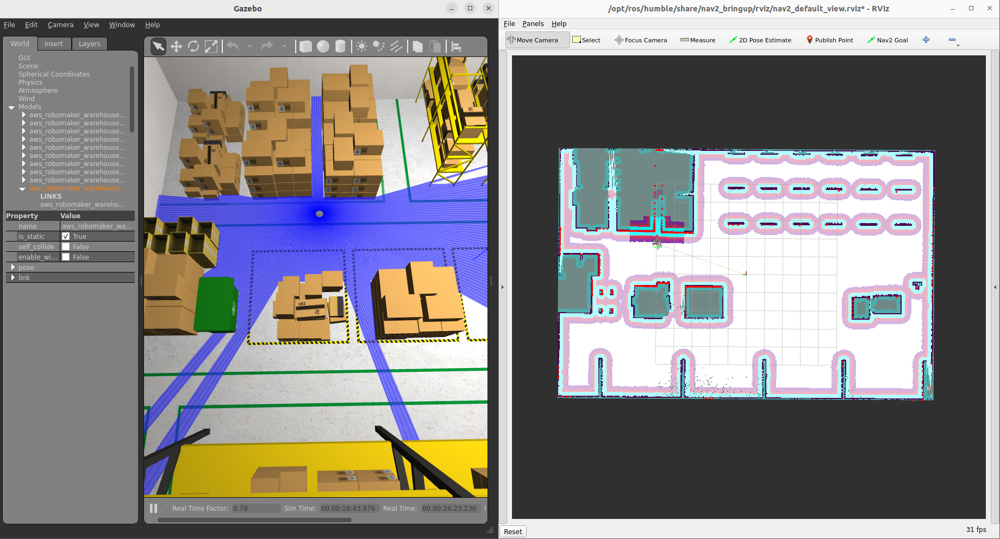
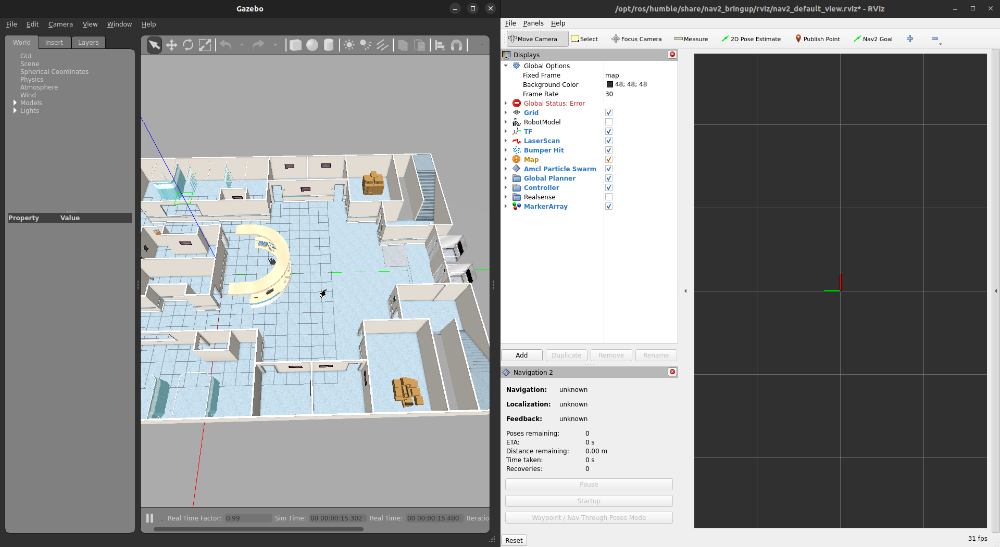
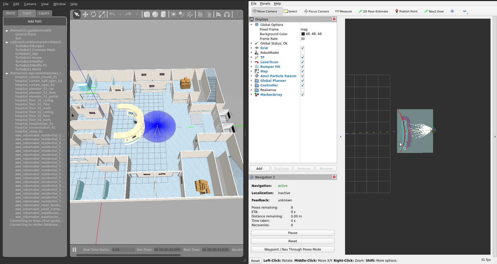
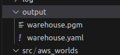
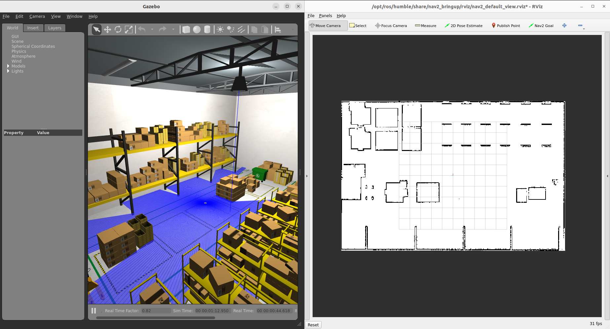

## Goal
In this package, you will learn how to generate a 2D map (in `.yaml` file) for your desired 3D world with the help of the `tb3_simulation_launch.py` from the `nav2_bringup` package (A subpackage in [`navigation2`](https://github.com/ros-planning/navigation2)). It is a launch file that launches the graphical interface, Rviz2, for you to control a turtlebot3 robot using the built-in navigation algorithm in Nav2, generate a 2D map with SLAM, and Gazebo will be used to simulate the real world situation.

## Preparation
1. Inside `ros2-agv-essentials/aws_robotics_worlds_ws/docker/Dockerfile`, find the line `ARG USERNAME=user` and replace `user` with YOUR OWN USERNAME before building the container.
>You can check your username by typing `echo $USERNAME` in the local terminal.

2. Build docker container with VS Code

    i. Go to "Extensions" window in VS Code (or use `Ctrl+Shift+X`), search for "Remote Development" and install it.

    ii. In VS Code, use `View->Command Palette...` or simple use `Ctrl+Shift+P` to open Command Palette window. 

    iii. Building a container
    - If it is the first time you building a container, or you want to replace your old container with a brand new one: Search and go for `Dev Containers: Rebuild Without Cache and Reopen in Container`.
        > It might took 3-5 minutes to build the container from scratch, so please be patient.
    - Otherwise (i.e. you want to use the existing container you built before): Search and go for `Dev Containers: Reopen in Container`.
    > After the image is successfully built, you should see a terminal showing:
    > 
    >
    > Now, you can open a new terminal with `Terminal->New Terminal` (or `Ctrl+Shift+`\`), and the image for ROS2 development is ready!
    > 

    iv. Closing the container (when you need to)

    If you want to close the container, press the "Remote Connection" controll button the on the bottom-left corner in the VS Code window. (The blue button as shown.)
    
    

    You will see some options about the remote connection, choosing `Close Remote Connection` will close the remote connection and the container will also be closed at the same time.
    
3. Install the required packages
```bash
sudo apt update
# install the Nav2 packages
sudo apt install ros-$ROS_DISTRO-navigation2
sudo apt install ros-$ROS_DISTRO-nav2-bringup
# install the Turtlebot3 packages
sudo apt install ros-$ROS_DISTRO-turtlebot3-gazebo
```


## Getting started
### Set environmental variables with `export`
```bash
# Set waffle to be the turtlebot3 model we will be using
export TURTLEBOT3_MODEL=waffle
# Set the "Gazebo model path" such that Gazebo is able to load the physical models we need
export GAZEBO_MODEL_PATH=$GAZEBO_MODEL_PATH:/opt/ros/humble/share/turtlebot3_gazebo/models
```

### Launch the `tb3_simulation_launch.py` file with its default settings
```bash
ros2 launch nav2_bringup tb3_simulation_launch.py headless:=False
# Note that if headless:=True, the Gazebo simulator will not be used
```
>Please be patient since it might took some time (1-2 minutes) for Gazebo to load the world for the first time.

The result should be like this:

>#### How to control the bot?
> - On Rviz2:
>   - Set the initial pose by clicking the "2D Pose Estimate" button, and then left click the corresponding location in Rviz2 as the robot located in the Gazebo world.
>   - Set the target pose by clicking the "Nav2 Goal" button, and then left click the location wherever you want.

## Switching to a different worlds
### Add the models folder of your world to `GAZEBO_MODEL_PATH`
```bash
export GAZEBO_MODEL_PATH=$GAZEBO_MODEL_PATH:<models_folder_of_the_desired_world>

# If you wanted to "replace" the model path rather than "adding" one, please try:
export GAZEBO_MODEL_PATH=<models_folder_of_the_desired_world>
# (However, since we need both the turtlebot3 models and the models for the world, we mostly used the above command.)
```
> If you did not add the desired models to `GAZEBO_MODEL_PATH` before launching, Gazebo will not be able to load the models needed for your world, and ended up not showing anything.
> 
> 

### Add the `world` argument
The `tb3_simulation_launch.py` has declared lots of useful launch arguments, which makes us easy to customize the result of this launch file. One of them is `world`, which controls the virtual world to be simulated in Gazebo, and allows us to change the "world" by simply adding `world:=<desired_world_file>` at the end of the launch command. (The order of the launch arguments does not matters.)
```bash
ros2 launch nav2_bringup tb3_simulation_launch.py headless:=False world:=<desired_world_file>
```
#### Example: Warehouse
```bash
# export models
export GAZEBO_MODEL_PATH=$GAZEBO_MODEL_PATH:/home/ros2-agv-essentials/aws_robotics_worlds_ws/src/aws_worlds/aws_warehouse/models
# launch the file with 'world' specified
ros2 launch nav2_bringup tb3_simulation_launch.py headless:=False world:=/home/ros2-agv-essentials/aws_robotics_worlds_ws/src/aws_worlds/aws_warehouse/worlds/small_warehouse.world
```
>The result should be like this:
>
> (If the world does not changed, reopening the container is a good way to try ^^)

#### Example: Hospital
```bash
# export models
export GAZEBO_MODEL_PATH=$GAZEBO_MODEL_PATH:/home/ros2-agv-essentials/aws_robotics_worlds_ws/src/aws_worlds/aws_hospital/models
# launch the file with 'world' specified
ros2 launch nav2_bringup tb3_simulation_launch.py headless:=False world:=/home/ros2-agv-essentials/aws_robotics_worlds_ws/src/aws_worlds/aws_hospital/worlds/hospital.world
```
> Result:
> 
>
> (For hospital, the world might be too large/complicated for Gazebo to load that the turtlebot3 may not be spawned when the world is loaded. If this happened, you may need to manually spawn the turtlebot3 by ​dragging a `TurtleBot3(Waffle)` from the left tool bar to the world.)
>
> 
> 
## Generating a `.yaml` 2D map
From the above launching example, you may notice that the 2D map used in Rviz2 is still the default one, and this is not what we wanted. In the following instructions, you will learn how to generate your own 2D map using SLAM (Simultaneous localization and mapping) with the given turtlebot3, saving it, and enjoy navigating in the map!

### Use SLAM!
Similarly, it is fairly easy to turn on/off the built-in SLAM since it is also a well declared launch argument: `slam`. It is `False` by default and Rviz2 will open the chosen map (pointed by the launch argument `map`). Therefore, if you want to turn on SLAM, just explicitly switch it to `True`!
#### Example: Warehouse
```bash
# As usual, make sure you have export the required models before launching!
ros2 launch nav2_bringup tb3_simulation_launch.py headless:=False world:=/home/ros2-agv-essentials/aws_robotics_worlds_ws/src/aws_worlds/aws_warehouse/worlds/small_warehouse.world slam:=True
```
The result should be like this:
- Rviz2 is now showing the turtlebot model itself, and the "vision" of the bot, including the Laser Scan (red dots), Global Planner (color distributions surrounding the walls), etc...
- Enjoy exploring and scanning the world by simply using the "Nav2 Goal" button!

- After traversing through the world, you may get a resulting map in Rviz2 looks like this:


> - The following instruction will teach you how to save the 2D map you happy with, so DO NOT CLOSE the running program before saving your map.

#### Example: Hospital
- By similarly changing the `world` launch argument, you could also try scanning the hospital world! Just do not forget the `export` the models you need.
> As mentioned before, the turtlebot3 might not be spawned even when the world is loaded. At this time, Rviz2 is showing nothing since there is no bot for it to control.
> 
>
> After we manually spawn a turtlebot, Rviz2 will be able to find the bot and therefore you can control it.
> 
## Saving the resulting 2D map
From now, you have your own scanned 2D map in the running Rviz2, and you are going to save it as `.yaml` file. We will be using another subpackage in Nav2: `nav2_map_server`, which provides nodes that can load or save map for the Nav2 application using topics and services interface ([Learn more](https://github.com/ros-planning/navigation2/tree/main/nav2_map_server)). In general, it allows us to save the desired map by simply using CLI (Command line interface).

To save the map, open a new terminal and type:
```bash
ros2 run nav2_map_server map_saver_cli -f <desired_file_path_and_name>
```
For example:
```bash
# Make sure the directory "/home/ros2-agv-essentials/aws_robotics_worlds_ws/output/" is actually exist
ros2 run nav2_map_server map_saver_cli -f /home/ros2-agv-essentials/aws_robotics_worlds_ws/output/warehouse
```
> It should generate a `warehouse.pgm` and a `warehouse.yaml` file as follow:



## Navigate in your own map
After you have created and saved your own 2D map, you can use it in your further exploration in Nav2! To check if your 2D map is well generated, you can again, use the `tb3_simulation_launch.py` file to do it by assigning your map to the launching argument `map`.
```bash
ros2 launch nav2_bringup tb3_simulation_launch.py headless:=False world:=<desired_world_file> map:=<desired_map_file>
```
For example:
```bash
ros2 launch nav2_bringup tb3_simulation_launch.py headless:=False world:=/home/ros2-agv-essentials/aws_robotics_worlds_ws/src/aws_worlds/aws_warehouse/worlds/small_warehouse.world map:=/home/ros2-agv-essentials/aws_robotics_worlds_ws/output/warehouse.yaml
```
> Result:\
> Again, you can use the built-in navigation method to traverse the map using "2D Pose Estimate" and "Nav2 Goal".
>

## Reference
[Nav2 - Getting Started](https://navigation.ros.org/getting_started/index.html)
\
[ROS2與Navigation2入門教程-使用SLAM製圖的同時進行導航](https://www.ncnynl.com/archives/202110/4710.html)
