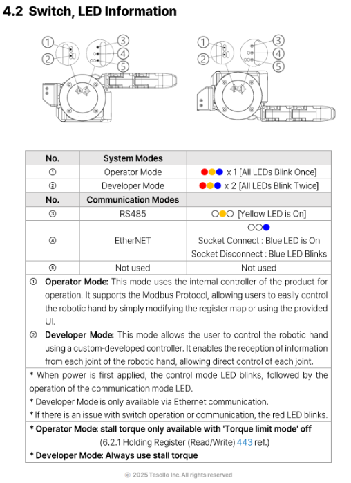

# dg5f_driver ROS 2 Package 🚀

## 📌 Overview

The `dg5f_driver` ROS 2 package provides a hardware interface leveraging [ros2_control](https://control.ros.org/) for the DG-3F-M grippers, enabling direct robotic control operations.

## 📦 Dependency Installation

### Navigate to Workspace
```bash
cd ~/your_ws
```

### Update rosdep
```bash
apt update
rosdep update
```

### Install Specific Dependencies
```bash
rosdep install --from-paths src/DELTO_M_ROS2/dg5f_driver --ignore-src -r -y
```

### Verify Installation by Building
```bash
colcon build --packages-select dg5f_driver
```

## ⚠️ Before You Control: Notes

The dg5f_driver (ros2 control) are currently using operates in Developer Mode, which uses a custom protocol over Ethernet.
If the gripper is set to Developer Mode, please make sure that switches ② and ④ are in the correct positions, as shown in the attached image.

 


## 🎛️ Controlling Delto Gripper-5F-LEFT

### 1\. Loading Delto-Gripper-5F-LEFT controller

Launch the Delto Gripper-5F-LEFT controller with:
```bash
ros2 launch dg5f_driver dg5f_left_driver.launch.py
```

### 2\. Here's a simple topic-based control command example:
-  **Python Example**: [dg5f_left_test.py](script/dg5f_left_test.py)

Run the Python test script:
```bash
ros2 run dg5f_driver dg5f_left_test.py
```

## 🎛️ Controlling Delto Gripper-5F-RIGHT

### 1\. Loading Delto-Gripper-5F-RIGHT controller

Launch the Delto Gripper-5F-RIGHT  controller with:
```bash
ros2 launch dg5f_driver dg5f_right_driver.launch.py
```

### 2\. Here's a simple topic-based control command example:
-  **Python Example**: [dg5f_right_test.py](script/dg5f_right_test.py)

Run the Python test script:
```bash
ros2 run dg5f_driver dg5f_right_test.py
```

## 🤝 Contributing
Contributions are encouraged:

1. Fork repository
2. Create branch (`git checkout -b feature/my-feature`)
3. Commit changes (`git commit -am 'Add my feature'`)
4. Push (`git push origin feature/my-feature`)
5. Open pull request

## 📄 License
BSD-3-Clause

## 📧 Contact
[TESOLLO SUPPORT](mailto:support@tesollo.com)

