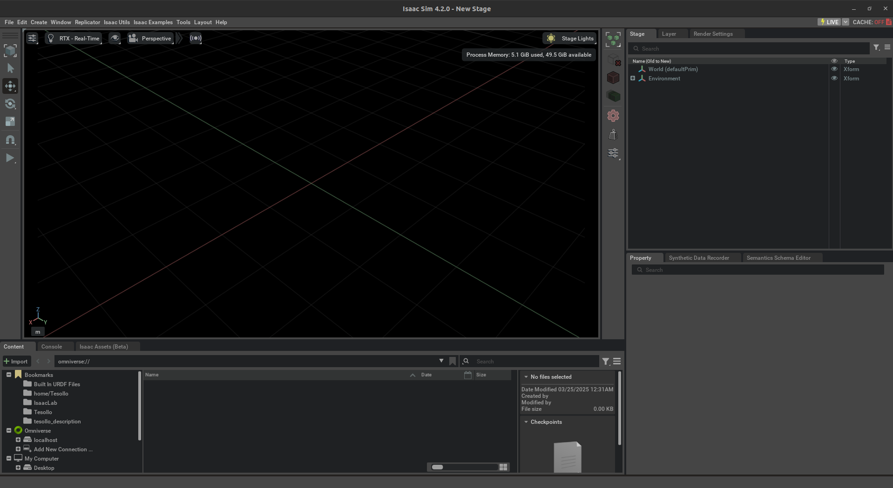
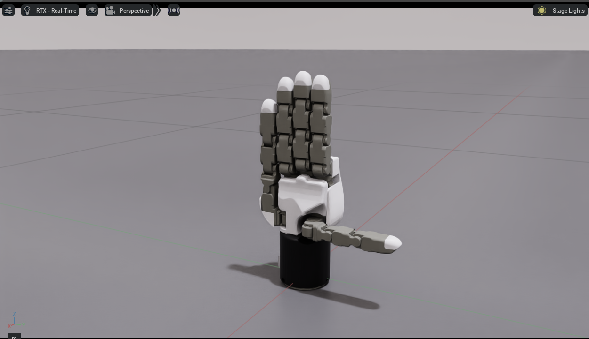
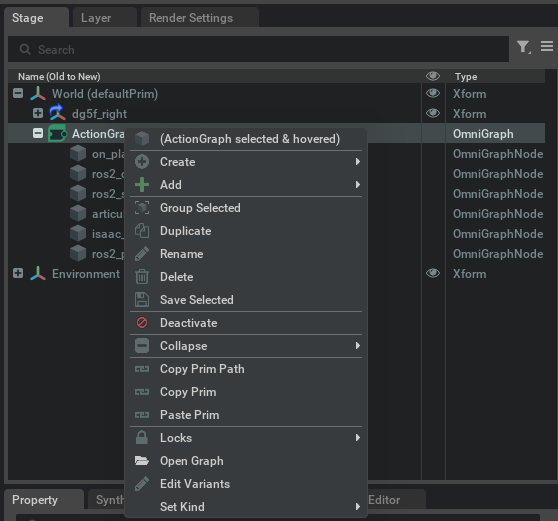
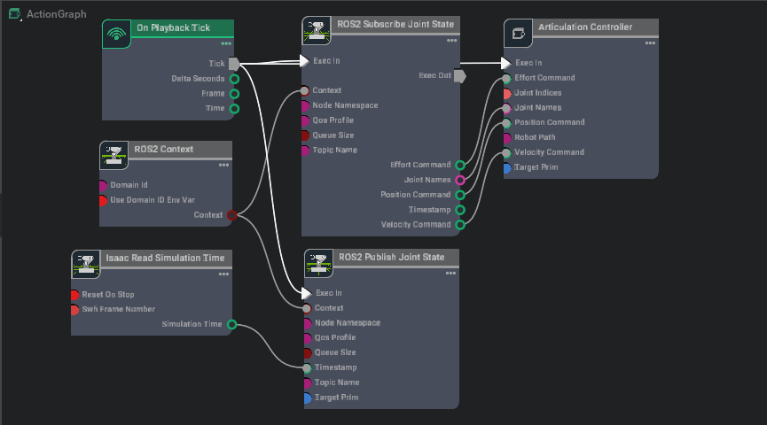
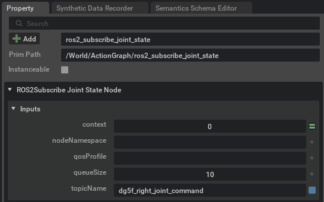
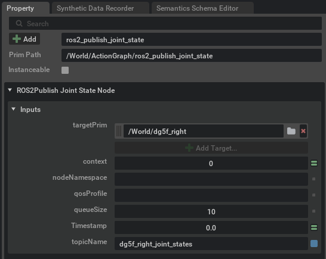

# dg_isaacsim Package

## Overview

The `dg_isaacsim` package provides a demonstration of integrating ROS2 with Isaac Sim, focusing on the use of Generic Publisher and Subscriber communication nodes within the simulation environment. It utilizes .usd files, which are the native file format for Isaac Sim. These files allow for the representation of Delto Gripper's 3D models.

## Key Features
- **ROS2 Integration**: Demonstrates communication between ROS2 nodes using Publisher and Subscriber to send and receive simulation data (such as control commands, and states) in real-time.
- **Real-time Data Streaming**: The package can stream data, such as robot positions and sensor data, to and from ROS2 topics, allowing for direct interaction with real-world robotic systems or further simulation tasks from data glove for teleoperation to collect the imiation learning dataset.

## Included Files
- **ros2/real2sim.py**: ROS2 node that connects a robot's joint states to a simulation in Isaac Sim
- **dg5f_right/dg5f_right_ros2.usd**: Universal Scene Description (.usd), which enables seamless interaction between ROS2 and the simulation environment

## Isaac Sim Setup
| **Description** | **Image** |
|-----------------|-----------|
| Launch Isaac Sim by executing the App Selector from the installation root directory. |  |
| Open the `dg5f_right_ros2.usd` file to load the robot model for simulation. |  |
| Load the pre-configured ActionGraph to manage robotic tasks and actions. |  |
| Inspect the ActionGraph to understand the connections and structure of the simulation nodes. |  |
| Set the topic name for subscribing to joint state updates from the ROS2 bridge in the `ros2_subscribe_joint_state` node. |  |
| Set the topic name for publishing the joint state data from the `ros2_publish_joint_state` node. |  |

## ROS2 workspace Setup
- Create a ROS2 Workspace
- Save the provided Python code
- Build and Source the Workspace
- Run the bridge node in your own ROS2 workspace to facilitate communication between ROS2 and Isaac Sim

## License
This project is released under the BSD-3-Clause license.

## Contact
For additional support or inquiries about this project, please contact [TESOLLO SUPPORT](mailto:support@tesollo.com). 

