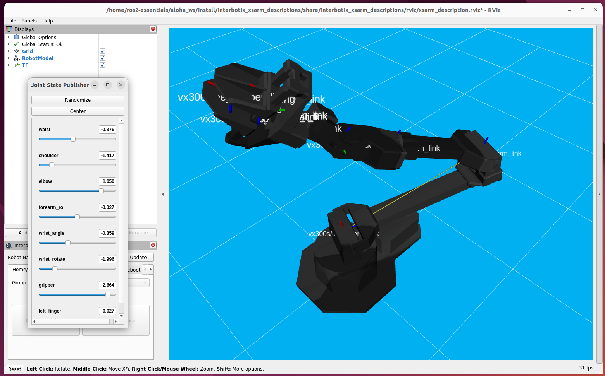
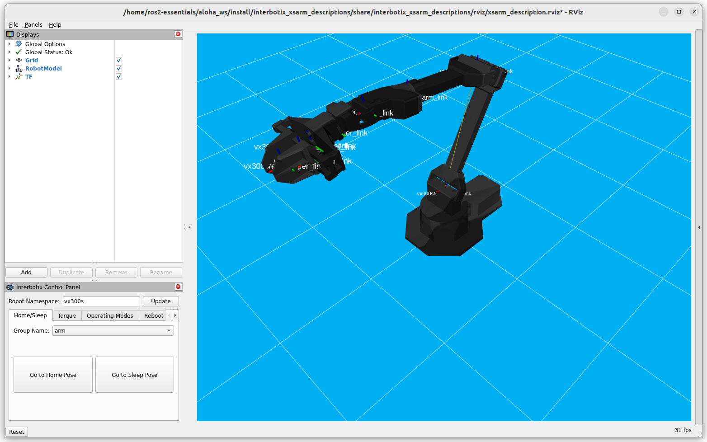
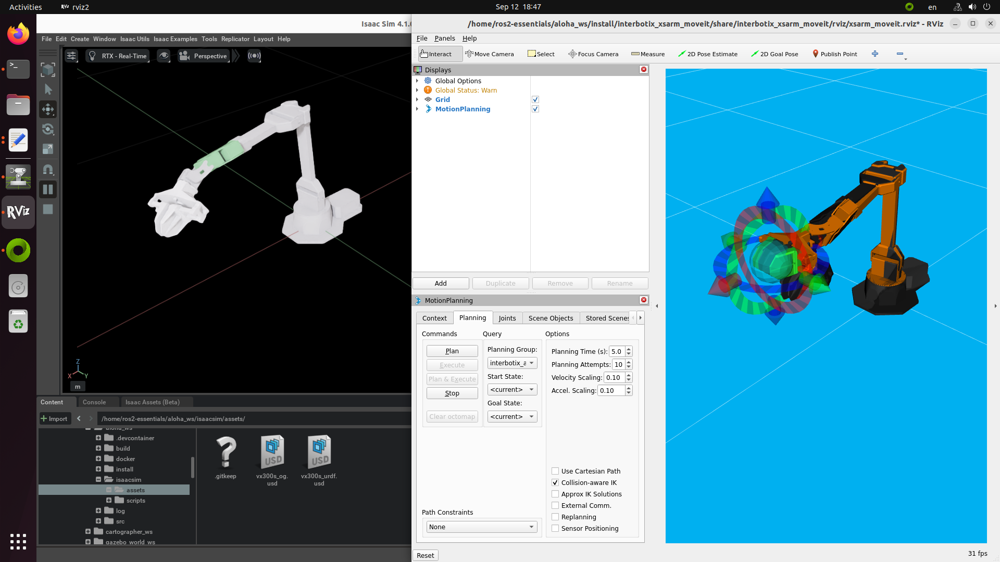

# ALOHA

[](https://github.com/j3soon/ros2-essentials/tree/main/aloha_ws)
[](https://github.com/j3soon/ros2-essentials/actions/workflows/build-aloha-ws.yaml)
[](https://github.com/j3soon/ros2-essentials/commits/main/aloha_ws)

[](https://hub.docker.com/r/j3soon/ros2-aloha-ws/tags)


## Start Container

```sh
cd ~/ros2-essentials/aloha_ws/docker
xhost +local:docker
docker compose up
# The initial build will take a while (~10 mins), please wait patiently.
```

The commands in the following sections assume that you are inside the Docker container:

```sh
# in a new terminal
docker exec -it ros2-aloha-ws bash
```

If the initial build somehow failed, run:

```sh
rm -r build install
colcon build --symlink-install
```

## View Robot Model in RViz

```sh
ros2 launch interbotix_xsarm_descriptions xsarm_description.launch.py robot_model:=vx300s use_joint_pub_gui:=true
```

It is worth noting that `aloha_vx300s.urdf.xacro` and `vx300s.urdf.xacro` files are identical. We opt to use `vx300s` since `aloha_vx300s` seems to lack corresponding configs, such as those for MoveIt 2.



## View Robot Model in Gazebo

```sh
ros2 launch interbotix_xsarm_sim xsarm_gz_classic.launch.py robot_model:=vx300s
```

## ROS 2 Control

```sh
ros2 launch interbotix_xsarm_control xsarm_control.launch.py robot_model:=vx300s use_sim:=true
# and then use the `Interbotix Control Panel`.
```



## MoveIt 2 with RViz

```sh
ros2 launch interbotix_xsarm_moveit xsarm_moveit.launch.py robot_model:=vx300s hardware_type:=fake
```


## MoveIt 2 with Gazebo

```sh
ros2 launch interbotix_xsarm_moveit xsarm_moveit.launch.py robot_model:=vx300s hardware_type:=gz_classic
```


## MoveIt 2 with Isaac Sim

Prepare USD files:

```sh
cd /home/ros2-essentials/aloha_ws/isaacsim/scripts
./create_urdf_from_xacro.sh
python3 create_vx300s_from_urdf.py
python3 create_vx300s_with_omnigraph.py
```

and run:

```sh
ros2 launch interbotix_xsarm_moveit xsarm_moveit.launch.py robot_model:=vx300s hardware_type:=isaac
# and then move the target and use the `MotionPlanning` panel.
```



### Debugging with Isaac Sim

The Isaac Sim app can be launched with:

```sh
isaacsim isaacsim.exp.full
```

Keep in mind that the standalone scripts can be easily debugged in Isaac Sim's `Script Editor`.
Simply copy the code, omitting anything related to SimulationApp (remove the beginning and end),
and paste to the `Script Editor` and run it.

To open pre-configured USD file with OmniGraph:

- `File > Open` and click `My Computer`, then in `File name:` type:
  ```
  /home/ros2-essentials/aloha_ws/isaacsim/assets/vx300s_og.usd
  ```
- Click `Window > Visual Scripting > Action Graph`
- In the `Action Graph` tab, click `Edit Action Graph` and select `/ActionGraph`
- Click `Play (SPACE)`

View the current joint states:

```sh
# in a new terminal
docker exec -it ros2-aloha-ws bash
ros2 topic echo /vx300s/joint_states
```

A specific world can also be directly launched and played with:

```sh
isaacsim isaacsim.exp.full --exec '/home/ros2-essentials/aloha_ws/isaacsim/scripts/open_isaacsim_stage.py --path /home/ros2-essentials/aloha_ws/isaacsim/assets/vx300s_og.usd'
```

To access Nucleus from Isaac Sim, you should [install Nucleus](https://docs.omniverse.nvidia.com/nucleus/latest/workstation/installation.html) with default username/password `admin:admin` on your host machine or connect to an external Nucleus server.

## References

- [Interbotix X-Series Arms \| Trossen Robotics Documentation](https://docs.trossenrobotics.com/interbotix_xsarms_docs/index.html)
  - [ROS 2 Interface](https://docs.trossenrobotics.com/interbotix_xsarms_docs/ros_interface/ros2.html)
    - [ROS 2 Standard Software Setup](https://docs.trossenrobotics.com/interbotix_xsarms_docs/ros_interface/ros2/software_setup.html)
  - [ROS 2 Open Source Packages](https://docs.trossenrobotics.com/interbotix_xsarms_docs/ros2_packages.html)
- [Stationary ALOHA Software Setup \| Trossen Robotics Documentation](https://docs.trossenrobotics.com/aloha_docs/getting_started/stationary/software_setup.html)
