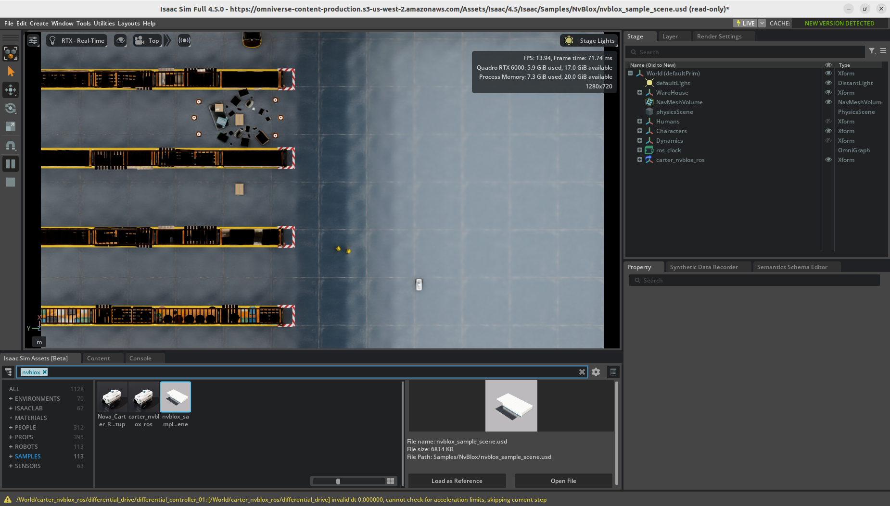

# Isaac ROS

[](https://github.com/j3soon/ros2-essentials/blob/main/docker_modules/install_isaac_ros.sh)

> Note: This is a work in progress. Currently only the base Isaac ROS is installed. Running examples requires additional dependencies that are not yet included in this setup.

Isaac ROS 3.2. (Not installed by default.)

Depends on:

- ROS 2 Humble
- CUDA Toolkit 12.6

Including:

- VPI

To enable Isaac ROS, set the `ISAAC_ROS` argument to `YES` and the `CUDA_TOOLKIT_VERSION` argument to `12.6` in the `compose.yaml` file of your desired workspace (e.g., `husky_ws/docker/compose.yaml`). After making these changes, rebuild the Docker image.

Note that most packages are not installed by default to save disk space. Feel free to open an issue for requesting more packages to be installed along with Isaac ROS.

## Setup

On host:

1. Edit `~/template_ws/docker/compose.yaml` to set `CUDA_TOOLKIT_VERSION: "12.6"` and `ISAAC_ROS: "YES"`.
2. Re-build the docker image with `docker compose build`.

The remaining steps should all be executed within the docker container.

Install Isaac ROS Examples package (optional):

```sh
sudo apt-get install -y ros-humble-isaac-ros-examples
```

## Start Simulation Environment (Isaac Sim)

Apply [the CUDA workaround](https://docs.isaacsim.omniverse.nvidia.com/4.5.0/overview/known_issues.html) and launch Isaac Sim:

```sh
# Workaround for CUDA error
export LD_LIBRARY_PATH=/home/user/isaacsim/extscache/omni.sensors.nv.common-2.5.0-coreapi+lx64.r.cp310/bin:$LD_LIBRARY_PATH
~/isaacsim/isaac-sim.sh
```

- For AprilTag and Visual SLAM:

  Click `Window > Examples > Robotics Examples`. In the `Robotics Examples` window, select `ROS2 > Isaac ROS > Sample Scene` and click `Load Sample Scene`. After the scene loaded, click the `Play` button to start the simulation.

  

- For Nvblox:

  Click `Isaac Sim Assets [Beta] > SAMPLES`, search for `nvblox_sample_scene.usd`, select it and click `Open File`. After the scene loaded, click the `Play` button to start the simulation. If a warning message appears, click `OK` to allow script execution.

  

Open another terminal and exec into the docker container. Then, follow one of the tutorials below.

## Isaac ROS AprilTag

Follow the [Quickstart](https://nvidia-isaac-ros.github.io/repositories_and_packages/isaac_ros_apriltag/isaac_ros_apriltag/index.html#quickstart) and [Isaac Sim](https://nvidia-isaac-ros.github.io/concepts/fiducials/apriltag/tutorial_isaac_sim.html) tutorials.

Install Isaac ROS AprilTag package:

```sh
sudo apt-get install -y ros-humble-isaac-ros-apriltag
```

Start the pre-composed pipeline:

```sh
ros2 launch isaac_ros_apriltag isaac_ros_apriltag_isaac_sim_pipeline.launch.py
```

In another terminal, launch RViz:

```sh
rviz2 -d $(ros2 pkg prefix isaac_ros_apriltag --share)/rviz/default.rviz
# or
ros2 topic echo /tag_detections
```


For further info, see more tutorials in [the official documentation](https://nvidia-isaac-ros.github.io/repositories_and_packages/isaac_ros_apriltag/isaac_ros_apriltag/index.html#try-more-examples).

## Isaac ROS Visual SLAM

> Using [cuVSLAM](https://nvidia-isaac-ros.github.io/concepts/visual_slam/cuvslam/index.html) under the hood.

Follow the [Quickstart](https://nvidia-isaac-ros.github.io/repositories_and_packages/isaac_ros_visual_slam/index.html#quickstarts) and [Isaac Sim](https://nvidia-isaac-ros.github.io/concepts/visual_slam/cuvslam/tutorial_isaac_sim.html) tutorials.

Install Isaac ROS Visual SLAM package:

```sh
sudo apt-get install -y ros-humble-isaac-ros-visual-slam
```

Start the pre-composed pipeline:

```sh
ros2 launch isaac_ros_visual_slam isaac_ros_visual_slam_isaac_sim.launch.py
```

In another terminal, send the control command to the robot:

```sh
ros2 topic pub --once /cmd_vel geometry_msgs/msg/Twist "{linear: {x: 0.2, y: 0.0, z: 0.0}, angular: {x: 0.0, y: 0.0, z: 0.2}}"
```

Then, launch RViz:

```sh
rviz2 -d $(ros2 pkg prefix isaac_ros_visual_slam --share)/rviz/isaac_sim.cfg.rviz
# or
ros2 topic echo /visual_slam/tracking/odometry
```


For further info, see more tutorials in [the official documentation](https://nvidia-isaac-ros.github.io/repositories_and_packages/isaac_ros_visual_slam/isaac_ros_visual_slam/index.html#try-more-examples).

## Isaac ROS Nvblox

> Using [Nvblox](https://nvidia-isaac-ros.github.io/concepts/scene_reconstruction/nvblox/technical_details.html) under the hood.

Follow the [Quickstart](https://nvidia-isaac-ros.github.io/repositories_and_packages/isaac_ros_nvblox/isaac_ros_nvblox/index.html#quickstart) and [Isaac Sim](https://nvidia-isaac-ros.github.io/concepts/scene_reconstruction/nvblox/tutorials/tutorial_isaac_sim.html) tutorials.

Install Isaac ROS Nvblox package:

```sh
sudo apt-get install -y ros-humble-navigation2 ros-humble-nav2-bringup

sudo apt-get install -y ros-humble-isaac-ros-nvblox
```

Start the pre-composed pipeline:

```sh
ros2 launch nvblox_examples_bringup isaac_sim_example.launch.py
```

Then, click `2D Goal Pose` in the RViz window to set the goal pose.


For further info, see more tutorials in [the official documentation](https://nvidia-isaac-ros.github.io/concepts/scene_reconstruction/nvblox/index.html#examples).

## Isaac ROS cuMotion

https://nvidia-isaac-ros.github.io/concepts/manipulation/cumotion_moveit/tutorial_isaac_sim.html

```
sudo apt-get install -y ros-humble-moveit
```

```sh
sudo apt-get update
sudo apt-get install -y ros-humble-isaac-ros-cumotion-examples
```

https://nvidia-isaac-ros.github.io/getting_started/isaac_sim/index.html

Launch Isaac Sim 5.0 and load

```
https://omniverse-content-production.s3-us-west-2.amazonaws.com/Assets/Isaac/5.0/Isaac/Samples/ROS2/Scenario/isaac_manipulator_ur10e_robotiq_2f_140.usd
```

Play

Sanity check:

```sh
ros2 topic list
ros2 topic echo /clock
```

Xacro:

```sh
UR_TYPE=ur10e
URDF_FILE=${ISAAC_ROS_WS}/isaac_ros_assets/urdf/${UR_TYPE}.urdf
mkdir -p ${ISAAC_ROS_WS}/isaac_ros_assets/urdf && \
   xacro -o ${URDF_FILE} \
   /opt/ros/humble/share/ur_description/urdf/ur.urdf.xacro \
   ur_type:=${UR_TYPE} name:=${UR_TYPE}
# sed
cp ${URDF_FILE} ${URDF_FILE}.bak
sed -i '/<ros2_control/,/<\/ros2_control>/d' "${URDF_FILE}"
```

MoveIt and RViz:

```sh
UR_TYPE=ur10e
ros2 launch isaac_ros_cumotion_examples ur_isaac_sim.launch.py ur_type:=${UR_TYPE}
```

new terminal

cuMotion Planner:

```sh
ros2 run isaac_ros_cumotion cumotion_planner_node --ros-args
   -p robot:=$(ros2 pkg prefix --share isaac_ros_cumotion_robot_description)/xrdf/ur10e.xrdf \
   -p urdf_path:=${ISAAC_ROS_WS}/isaac_ros_assets/urdf/ur10e.urdf
```
