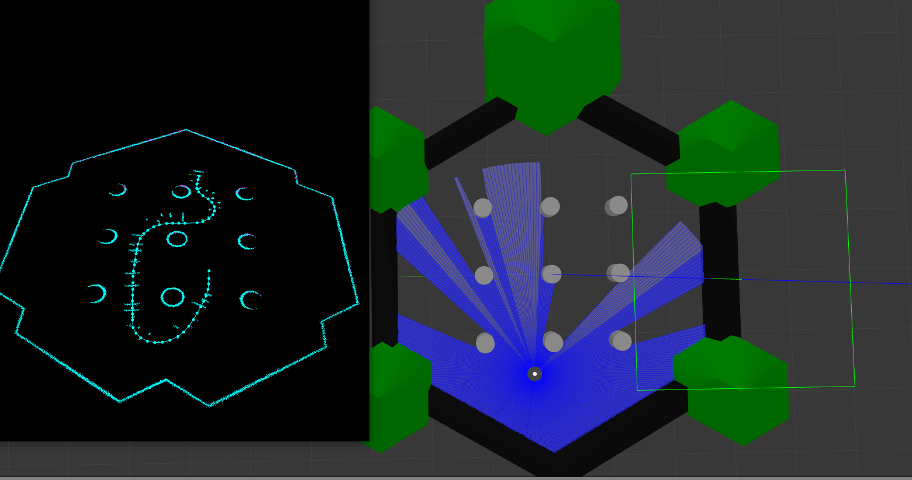
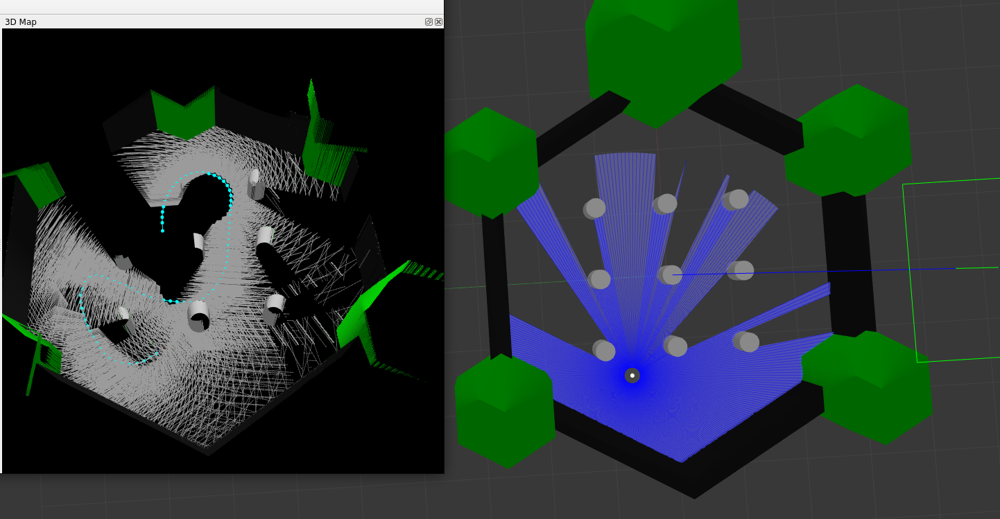
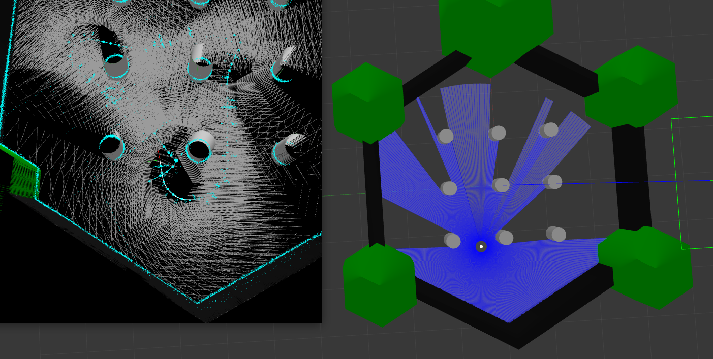

# RTAB-Map

[](https://github.com/j3soon/ros2-essentials/blob/main/docker_modules/install_rtabmap.sh)

> Last tested on TODO.

## 🐳 Start Container

> Make sure your system meets the [system requirements](https://j3soon.github.io/ros2-essentials/#system-requirements) and have followed the [setup instructions](https://j3soon.github.io/ros2-essentials/#setup) before using this workspace.

Run the following commands in a Ubuntu desktop environment. If you are using a remote server, make sure you're using a terminal within a remote desktop session (e.g., VNC) instead of SSH (i.e., don't use `ssh -X` or `ssh -Y`).

```sh
cd ~/ros2-essentials/template_ws/docker
docker compose build
xhost +local:docker
docker compose up -d
# The initial build will take a while, please wait patiently.
```

> If your user's UID is `1000`, you may replace the `docker compose build` command with `docker compose pull`.

The commands in the following sections assume that you are inside the Docker container:

```sh
# in a new terminal
docker exec -it ros2-template-ws bash
```

If the initial build somehow failed, run:

```sh
rm -r build install
colcon build --symlink-install
```

Once you have finished testing, you can stop and remove the container with:

```sh
docker compose down
```

## LiDAR test with gazebo

- Launch Gazebo with turtlebot3 in `tmux`
  ```bash
  ros2 launch rtabmap_sim sim_robot.launch.py
  ```
- Run rtabmap LiDAR demo in a new `tmux` window
  ```bash
  ros2 launch rtabmap_demos turtlebot3_scan.launch.py
  ```

## RGBD test with gazebo

- Launch Gazebo with turtlebot3 in `tmux`
  ```bash
  ros2 launch rtabmap_sim sim_robot.launch.py
  ```
- Run rtabmap LiDAR demo in a new `tmux` window
  ```bash
  ros2 launch rtabmap_demos turtlebot3_rgbd.launch.py
  ```

## Dual sensor test with gazebo

- Launch Gazebo with turtlebot3 in `tmux`
  ```bash
  ros2 launch rtabmap_sim sim_robot.launch.py
  ```
- Run dual sensor demo in a new `tmux` window
  ```bash
  ros2 launch rtabmap_sim dual_sensor.launch.py
  ```

## Run with rqt

- Running in a new `tmux` window
  ```bash
  ros2 run rqt_robot_steering rqt_robot_steering
  ```

## Result

- After you've run the demo, you could find the following result directly.

1. LiDAR test

  

2. RGBD test

   

3. Dual sensor test

   

## Reference

- [RTAB-Map wiki](https://github.com/introlab/rtabmap/wiki)

## Existing issues

- `VTK` warning
  ```bash
  QVTKOpenGLWidget: Warning: In /build/vtk6-6.3.0+dfsg1/Rendering/OpenGL2/vtkOpenGLRenderWindow.cxx, line 781
  ...
  ```
  - It seems that the warning isn't a big deal. But it will interrupt debugging in the future.
  - Possible solution : set `VTK_LEGACY_REMOVE`, but it required to build from source.
    - Still not tested yet.
  - [Issue Reference](https://discourse.vtk.org/t/vtk-9-0-rc1/2916)