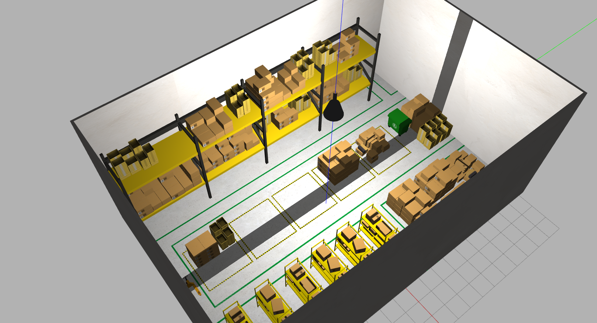
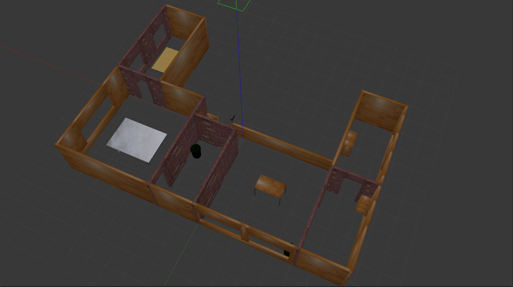
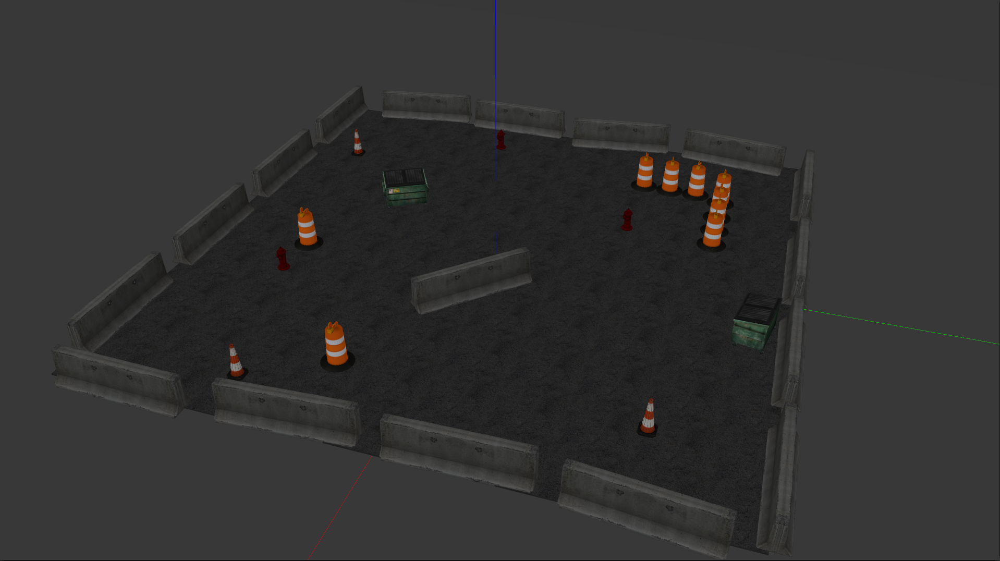

# Gazebo World

[](https://hub.docker.com/r/j3soon/ros2-gazebo-world-ws/tags)
[](https://github.com/j3soon/ros2-essentials/tree/main/gazebo_world_ws)
[](https://github.com/j3soon/ros2-essentials/commits/main/gazebo_world_ws)

This repository contains several Gazebo worlds, which are valuable for testing robots or agents in both indoor and outdoor environments.

## 🌱 Structure 🌱

```
ros2-essentials
├── gazebo_world_ws
|   ├── .devcontainer
|   ├── docker
|   ├── figure
|   ├── src
|   |   ├── aws-robomaker-hospital-world
|   |   ├── aws-robomaker-small-house-world
|   |   ├── aws-robomaker-small-warehouse-world
|   |   ├── citysim
|   |   ├── clearpath_playpen
|   |   ├── gazebo_launch
|   |   └── turtlebot3_gazebo
|   ├── .gitignore
|   └── README.md
└── ...
```

## 🚩 How to use 🚩

Available target worlds:
- aws_hospital
- aws_small_house
- aws_warehouse
- citysim
- clearpath_playpen
- turtlebot3

The turtlebot3 offers multiple worlds to choose from. For more information, you can refer to the launch file located at `turtlebot3.launch.py` in the `gazebo_launch` package.

### Use in `gazebo_world_ws` container

Normally, you wouldn’t want to use it inside the `gazebo_world_ws` container, since this workspace doesn’t include any robots by default. However, we still provide the Dockerfile for this workspace, you can use it if you have specific requirements.

```bash
# Build the workspace
cd /home/ros2-essentials/gazebo_world_ws
colcon build --symlink-install
source /home/ros2-essentials/gazebo_world_ws/install/setup.bash

# Launch the world
# Replace <target world> with the name of the world you wish to launch.
ros2 launch gazebo_launch <target world>.launch.py
# or launch turtlebot3 worlds, such as:
ros2 launch gazebo_launch turtlebot3.launch.py gazebo_world:=turtlebot3_dqn_stage3.world
```

### Use in other container/workspace

#### 1. Compile packages

To use it in other containers, remember to compile `gazebo_world_ws` first. Generally, you can compile it using other containers directly, as the required dependencies for these packages should already be installed in all workspaces. You should only use the Docker environment provided by `gazebo_world_ws` if you encounter issues with compilation or path settings.

```bash
# Build the workspace
cd /home/ros2-essentials/gazebo_world_ws
colcon build --symlink-install
```

#### 2. Source the `local_setup.bash`

Add the following lines into `.bashrc` file.

```bash
# Source gazebo_world_ws environment
GAZEBO_WORLD_WS_DIR="${ROS2_WS}/../gazebo_world_ws"
if [ ! -d "${GAZEBO_WORLD_WS_DIR}/install" ]; then
    echo "gazebo_world_ws has not been built yet. Building workspace..."
    cd ${GAZEBO_WORLD_WS_DIR}
    colcon build --symlink-install
    cd -
    echo "gazebo_world_ws built successfully!"
fi
source ${GAZEBO_WORLD_WS_DIR}/install/local_setup.bash
```

#### 3. Launch gazebo in the launch file

 Add the code into your launch file.

> Remember to replace the `<target world>` with the one you want.

```python
from launch import LaunchDescription
from launch.actions import IncludeLaunchDescription, DeclareLaunchArgument
from launch.substitutions import PathJoinSubstitution, LaunchConfiguration
from launch_ros.substitutions import FindPackageShare

ARGUMENTS = [
    DeclareLaunchArgument(
        "launch_gzclient",
        default_value="True",
        description="Launch gzclient, by default is True, which shows the gazebo GUI",
    ),
]


def generate_launch_description():
    
    ...
    
    # Launch Gazebo
    launch_gazebo = IncludeLaunchDescription(
        PathJoinSubstitution(
            [
                FindPackageShare("gazebo_launch"), 
                "launch",
                "<target world>.launch.py",
            ],
        ),
        launch_arguments={
            "launch_gzclient": LaunchConfiguration("launch_gzclient"),
        }.items(),
    )
    
    ...
    
    ld = LaunchDescription(ARGUMENTS)
    ld.add_action(launch_gazebo)
    
    ...
    
    return ld
```

## ✨ Snapshot ✨

|       World       |                        Snapshot                         |
|:-----------------:|:-------------------------------------------------------:|
|   aws_hospital    |       |
|  aws_small_house  |    |
|   aws_warehouse   |      |
|      citysim      |            |
| turtlebot3_stage3 |  |
| turtlebot3_house  |   |
| turtlebot3_world  |   |
| clearpath_playpen |  |

## 🔍 Troubleshooting 🔍

### Getting stuck when launching Gazebo

The first time you launch a Gazebo world might take longer because Gazebo needs to download models from the cloud to your local machine. Please be patient while it downloads. If it takes too long, like more than an hour, you can check the `gzserver` logs in `~/.gazebo` to see where it’s getting stuck. The most common issue is using a duplicate port, which prevents Gazebo from starting. You can use `lsof -i:11345` to identify which process is using the port and then use `kill -9` to terminate it.

### Unable to find `gazebo_launch`

Please make sure you have sourced the `local_setup.bash` and compiled `gazebo_world_ws`. If you encounter a path issue, try removing the `install`, `build`, and `log` folders in `gazebo_world_ws` and compile the workspace in your container again.