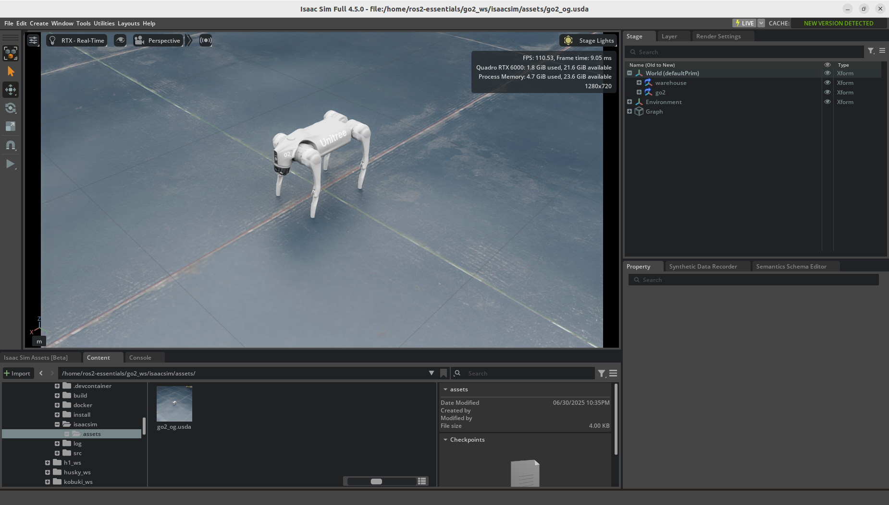
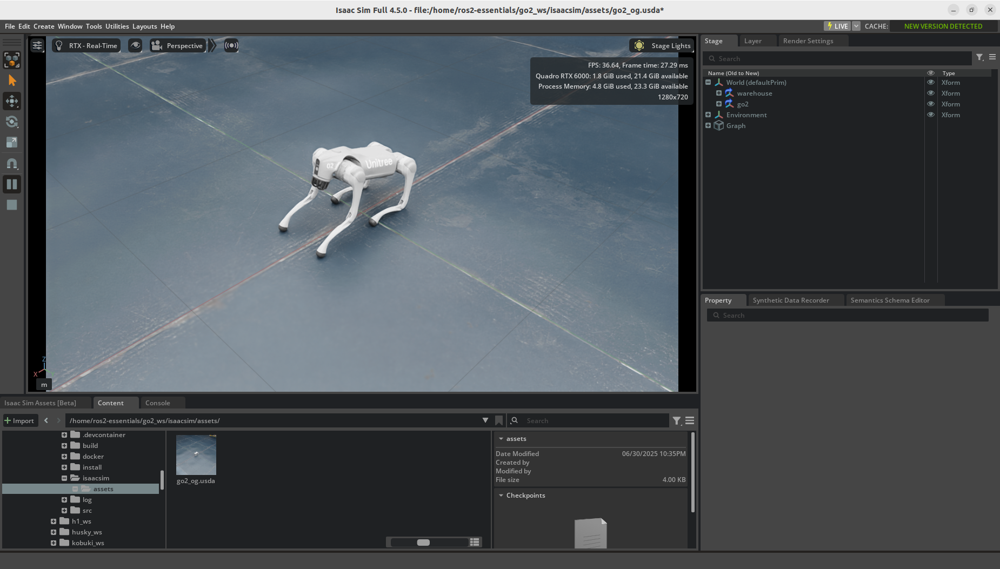
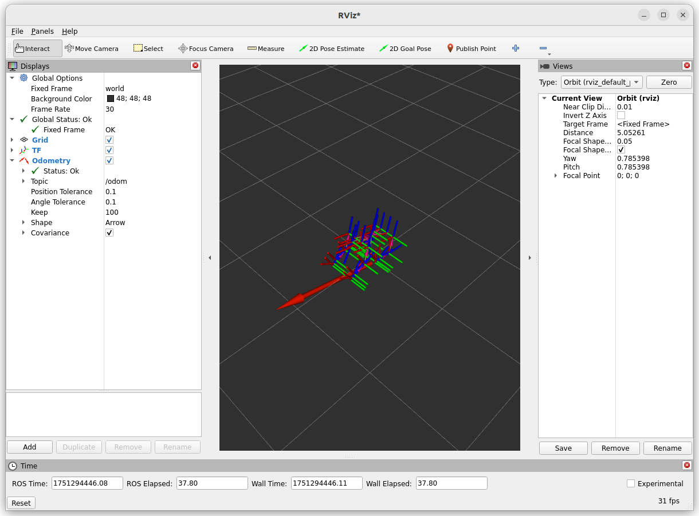
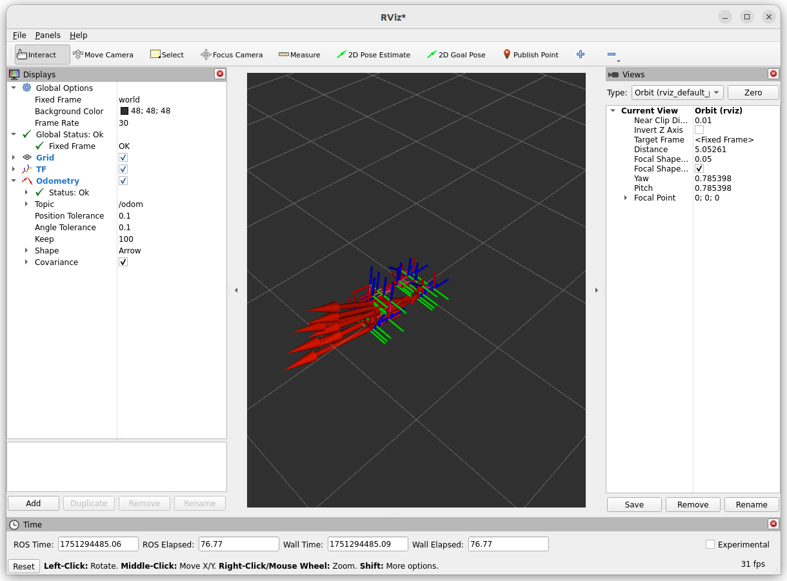

# Unitree Go2

[](https://github.com/j3soon/ros2-essentials/tree/main/go2_ws)
[](https://github.com/j3soon/ros2-essentials/actions/workflows/build-go2-ws.yaml)
[](https://github.com/j3soon/ros2-essentials/commits/main/go2_ws)

[](https://hub.docker.com/r/j3soon/ros2-go2-ws/tags)


> Please note that this workspace is only tested in simulation.

## 🐳 Start Container

> Make sure your system meets the [system requirements](https://j3soon.github.io/ros2-essentials/#system-requirements) and have followed the [setup instructions](https://j3soon.github.io/ros2-essentials/#setup) before using this workspace.

```sh
cd ~/ros2-essentials/go2_ws/docker
docker compose pull # or docker compose build
xhost +local:docker
docker compose up -d
```

The commands in the following sections assume that you are inside the Docker container:

```sh
# in a new terminal
docker exec -it ros2-go2-ws bash
```

If the initial build somehow failed, run:

```sh
rm -r build install
colcon build --symlink-install
```

Once you have finished testing, you can stop and remove the container with:

```sh
docker compose down
```

## Testing

### Isaac Lab Examples

[Training](https://isaac-sim.github.io/IsaacLab/main/source/overview/reinforcement-learning/rl_existing_scripts.html) [environments](https://isaac-sim.github.io/IsaacLab/main/source/overview/environments.html#comprehensive-list-of-environments) (`Isaac-Velocity-Flat-Unitree-Go2-v0`, `Isaac-Velocity-Rough-Unitree-Go2-v0`):

```sh
cd ~/IsaacLab
./isaaclab.sh -p scripts/reinforcement_learning/rsl_rl/train.py --task Isaac-Velocity-Rough-Unitree-Go2-v0 --headless
# or
./isaaclab.sh -p scripts/reinforcement_learning/skrl/train.py --task Isaac-Velocity-Rough-Unitree-Go2-v0 --headless
```

Run [pre-trained model inference](https://isaac-sim.github.io/IsaacLab/main/source/overview/reinforcement-learning/rl_existing_scripts.html):

```sh
cd ~/IsaacLab
./isaaclab.sh -p scripts/reinforcement_learning/rsl_rl/play.py --task Isaac-Velocity-Rough-Unitree-Go2-v0 --num_envs 32 --use_pretrained_checkpoint
```

### Custom Isaac Sim Environment

Run `~/isaacsim/isaac-sim.sh` and open `/home/ros2-essentials/go2_ws/isaacsim/assets/go2_og.usda` in Omniverse, and then press Play.




In another terminal, exec into the container:

```sh
docker exec -it ros2-go2-ws bash
```

Inspect the joint states and clock:

```sh
ros2 topic echo /joint_states
ros2 topic echo /clock
```

Inspect TF and Odom by launching `rviz2` and set `Fixed Frame` to `world` and `Add > TF`. Then, `Add > Odometry` and set `Topic` to `/odom`.



Send a joint command:

```sh
ros2 topic pub --once /joint_command sensor_msgs/msg/JointState "{
  name: [
    'FL_hip_joint', 'FR_hip_joint', 'RL_hip_joint', 'RR_hip_joint',
    'FL_thigh_joint', 'FR_thigh_joint', 'RL_thigh_joint', 'RR_thigh_joint',
    'FL_calf_joint', 'FR_calf_joint', 'RL_calf_joint', 'RR_calf_joint'
  ],
  position: [0.0, 0.0, 0.0, 0.0, 0.0, 0.0, 1.0, 1.0, 0.0, 0.0, 0.0, 0.0],
  velocity: [],
  effort: []
}"
```

The Go2 should move forward a little bit, which can be seen in both Isaac Sim and RViz2.



