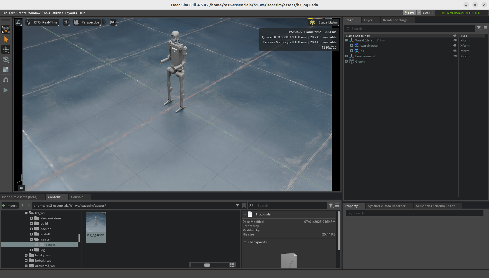
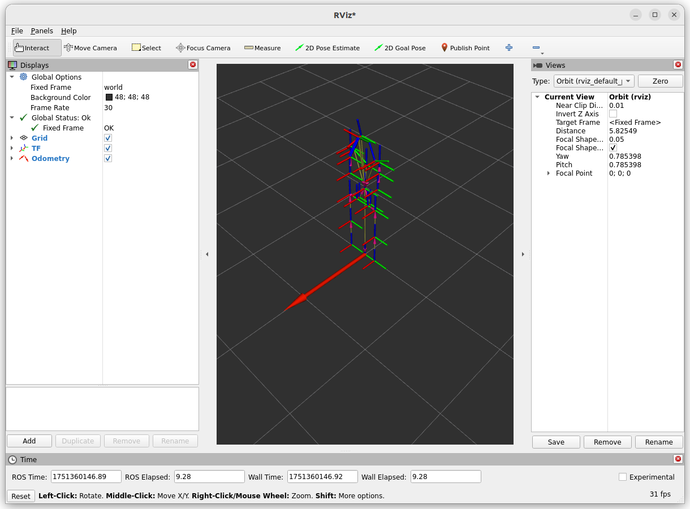
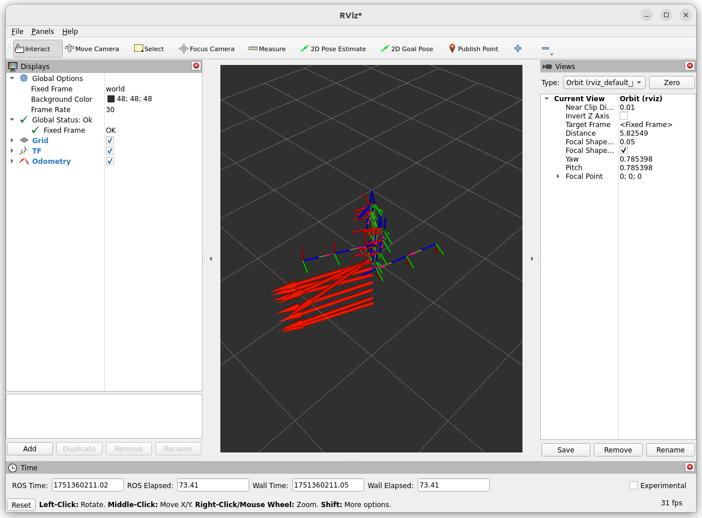

# Unitree H1

[](https://github.com/j3soon/ros2-essentials/tree/main/h1_ws)
[](https://github.com/j3soon/ros2-essentials/actions/workflows/build-h1-ws.yaml)
[](https://github.com/j3soon/ros2-essentials/commits/main/h1_ws)

[](https://hub.docker.com/r/j3soon/ros2-h1-ws/tags)


> Please note that this workspace is only tested in simulation.

## 🐳 Start Container

> Make sure your system meets the [system requirements](https://j3soon.github.io/ros2-essentials/#system-requirements) and have followed the [setup instructions](https://j3soon.github.io/ros2-essentials/#setup) before using this workspace.

Run the following commands in a Ubuntu desktop environment. If you are using a remote server, make sure you're using a terminal within a remote desktop session (e.g., VNC) instead of SSH (i.e., don't use `ssh -X` or `ssh -Y`).

```sh
cd ~/ros2-essentials/h1_ws/docker
docker compose build
xhost +local:docker
docker compose up -d
# The initial build will take a while, please wait patiently.
```

> If your user's UID is `1000`, you may replace the `docker compose build` command with `docker compose pull`.

The commands in the following sections assume that you are inside the Docker container:

```sh
# in a new terminal
docker exec -it ros2-h1-ws bash
```

If the initial build somehow failed, run:

```sh
rm -r build install
colcon build --symlink-install
```

Once you have finished testing, you can stop and remove the container with:

```sh
docker compose down
```

> If you encountered unexpected issues when using Isaac Sim, see [Known Issues](../docker-modules/isaac-sim.md#known-issues) for more details.

## Testing

### Isaac Sim Examples

[Deploying Policies](https://docs.isaacsim.omniverse.nvidia.com/latest/isaac_lab_tutorials/tutorial_policy_deployment.html#unitree-h1-humanoid-example):

```sh
cd ~/isaacsim
./isaac-sim.sh
```

`Window > Examples > Robotics Examples`, in the `Robotics Examples` window, click `POLICY > Humanoid > LOAD`.

### Isaac Lab Examples

[Training](https://isaac-sim.github.io/IsaacLab/main/source/overview/reinforcement-learning/rl_existing_scripts.html) [environments](https://isaac-sim.github.io/IsaacLab/main/source/overview/environments.html#comprehensive-list-of-environments) (`Isaac-Velocity-Flat-H1-v0`, `Isaac-Velocity-Rough-H1-v0`):

```sh
cd ~/IsaacLab
./isaaclab.sh -p scripts/reinforcement_learning/rsl_rl/train.py --task Isaac-Velocity-Rough-H1-v0 --headless
# or
./isaaclab.sh -p scripts/reinforcement_learning/skrl/train.py --task Isaac-Velocity-Rough-H1-v0 --headless
```

Run [pre-trained model inference](https://isaac-sim.github.io/IsaacLab/main/source/overview/reinforcement-learning/rl_existing_scripts.html):

```sh
cd ~/IsaacLab
./isaaclab.sh -p scripts/reinforcement_learning/rsl_rl/play.py --task Isaac-Velocity-Rough-H1-v0 --num_envs 32 --use_pretrained_checkpoint
```

Run [H1 Locomotion Showroom Demo](https://isaac-sim.github.io/IsaacLab/main/source/overview/showroom.html):

```sh
cd ~/IsaacLab
export PYTHONPATH=""
./isaaclab.sh -p scripts/demos/h1_locomotion.py
```

> Clearing the PYTHONPATH is necessary to avoid the error:
> 
> ```
> [INFO] Using python from: /home/user/IsaacLab/_isaac_sim/python.sh
> Traceback (most recent call last):
>   File "/home/user/IsaacLab/scripts/demos/h1_locomotion.py", line 23, in <module>
>     import scripts.reinforcement_learning.rsl_rl.cli_args as cli_args  # isort: skip
>   File "/opt/ros/humble/local/lib/python3.10/dist-packages/scripts/__init__.py", line 15, in <module>
>     from .gazebo_ros_paths import GazeboRosPaths
>   File "/opt/ros/humble/local/lib/python3.10/dist-packages/scripts/gazebo_ros_paths.py", line 32, in <module>
>     from catkin_pkg.package import InvalidPackage, PACKAGE_MANIFEST_FILENAME, parse_package
> ModuleNotFoundError: No module named 'catkin_pkg'
> There was an error running python
> ```

### Custom Isaac Sim Environment

Run `~/isaacsim/isaac-sim.sh` and open `/home/ros2-essentials/h1_ws/isaacsim/assets/h1_og.usda` in Omniverse, and then press Play.




In another terminal, exec into the container:

```sh
docker exec -it ros2-go2-ws bash
```

Inspect the joint states and clock:

```sh
ros2 topic echo /joint_states
ros2 topic echo /clock
```

Inspect TF and Odom by launching `rviz2` and set `Fixed Frame` to `world` and `Add > TF`. Then, `Add > Odometry` and set `Topic` to `/odom`.



Send a joint command:

```sh
ros2 topic pub --once /joint_command sensor_msgs/msg/JointState "{
  name: [
    'left_hip_yaw_joint',
    'right_hip_yaw_joint',
    'torso_joint',
    'left_hip_roll_joint',
    'right_hip_roll_joint',
    'left_shoulder_pitch_joint',
    'right_shoulder_pitch_joint',
    'left_hip_pitch_joint',
    'right_hip_pitch_joint',
    'left_shoulder_roll_joint',
    'right_shoulder_roll_joint',
    'left_knee_joint',
    'right_knee_joint',
    'left_shoulder_yaw_joint',
    'right_shoulder_yaw_joint',
    'left_ankle_joint',
    'right_ankle_joint',
    'left_elbow_joint',
    'right_elbow_joint'
  ],
  position: [0.0, 0.0, 0.0, 0.0, 0.0, 0.0, 0.0, 1.57, -1.57, 0.0, 0.0, 0.0, 0.0, 0.0, 0.0, 0.0, 0.0, 0.0, 0.0],
  velocity: [],
  effort: []
}"
```

The H1 should split its legs and fall to the ground, which can be seen in both Isaac Sim and RViz2.



