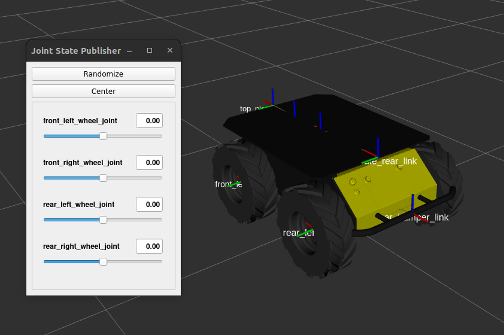

# husky_ws

This repository will help you configure the environment for Husky quickly.

## 🌱 Structure 🌱

Here is the structure of this workspace:

```
husky_ws
├── .devcontainer
├── docker
├── figure
├── install
├── build
├── log
├── script
|   ├── husky-bringup.sh
|   ├── husky-generate.sh
|   └── husky-teleop.sh
├── src
|   ├── husky
|   |   ├── husky_base
|   |   ├── husky_bringup
|   |   ├── husky_control
|   |   └── ...
├── udev_rules
|   ├── 41-clearpath.rules
|   └── install_udev_rules.sh
├── .gitignore
└── README.md
```

> ```build``` / ```install``` / ```log``` folders will appear once you've built the packages.

## ✨ Introduction ✨

This repository has been derived from the Clearpath Husky's repository. [Here](https://github.com/husky/husky/tree/humble-devel) is the original repository.  
However, the original repository was designed for ROS1, and it is in the process of being upgraded to ROS2.

Below are the main packages for Husky:

- husky_base : Base configuration
- husky_control : Control configuration
- husky_description : Robot description (URDF)
- husky_navigation : Navigation configuration
- husky_gazebo : Simulate environment
- husky_viz : Visualize data

## 🚩 Testing 🚩

### Building packages

Before attempting any examples, please remember to build the packages first.  
If you encounter any dependency errors, please use rosdep to resolve them.

```bash
cd /home/ros2-essentials/husky_ws
rosdep update
rosdep install --from-paths src --ignore-src --rosdistro humble -y
colcon build
```

> After the build process, make sure to source the `install/setup.bash` file.  
> Otherwise, ROS2 will not locate the executable files. You can open a new terminal to accomplish this.

### View the model

```bash
ros2 launch husky_viz view_model_launch.py
```

<div align="center">
    <a href="./">
        
    </a>
</div>

### Demonstration of SLAM.

```bash
ros2 launch husky_navigation slam_launch.py
```

> Rendering the model may take some time, so please be patient !

<div align="center">
    <a href="./">
        
        
    </a>
</div>

### Control real robot

> Before you proceed, please ensure that you've plugged the USB adapter of the Husky into the computer and mounted it into the container. (plugging in the USB adapter before creating the container is preferred but not required)

```bash=
# Move to the workspace, source .bashrc, and bringup husky.
cd /home/ros2-essentials/husky_ws
source ~/.bashrc
./script/husky-bringup.sh

# (Optional) Open a new terminal & control the robot via keyboard teleoperation.
./script/husky-teleop.sh
```

## License

To maintain reproducibility, we have frozen the following packages at specific commits. The licenses of these packages are listed below:

* [husky/husky](https://github.com/husky/husky) (at commit 1e0b1d1, `humble-devel` branch) is released under the [BSD-3-Clause License](https://github.com/husky/husky/blob/noetic-devel/LICENSE).
* [clearpathrobotics/LMS1xx](https://github.com/clearpathrobotics/LMS1xx) (at commit 90001ac, `humble-devel` branch) is released under the [LGPL License](https://github.com/clearpathrobotics/LMS1xx/blob/humble-devel/package.xml).
* [osrf/citysim](https://github.com/osrf/citysim) (at commit 3928b08) is released under the [Apache-2.0 License](https://github.com/osrf/citysim/blob/master/LICENSE).
* [clearpathrobotics/clearpath_computer_installer](https://github.com/clearpathrobotics/clearpath_computer_installer) (at commit 7e7f415) is released under the [BSD-3-Clause License](https://github.com/clearpathrobotics/clearpath_computer_installer/blob/main/LICENSE).
* [clearpathrobotics/clearpath_robot/clearpath_robot/debian/udev](https://github.com/clearpathrobotics/clearpath_robot/blob/17d55f1b27d3fe19fb82e7df64dca96dbd345837/clearpath_robot/debian/udev) (at commit 17d55f1) is released under the [BSD 3-Clause License](https://github.com/clearpathrobotics/clearpath_robot/blob/17d55f1b27d3fe19fb82e7df64dca96dbd345837/LICENSE).

Further changes based on the packages above are release under the [Apache-2.0 License](https://github.com/j3soon/ros2-essentials/blob/main/LICENSE), as stated in the repository.
