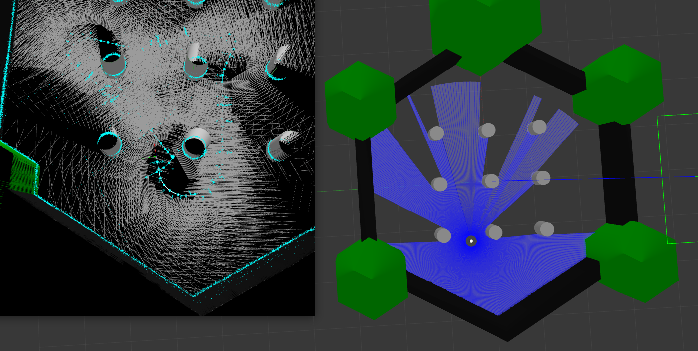

# RTAB-Map

[](https://hub.docker.com/r/j3soon/ros2-rtabmap-ws/tags)
[](https://github.com/j3soon/ros2-essentials/tree/main/rtabmap_ws)
[](https://github.com/j3soon/ros2-essentials/commits/main/rtabmap_ws)

### Run with docker

```bash
git clone https://github.com/j3soon/ros2-essentials.git
```

```bash
cd ros2-essentials/rtabmap_ws/docker
docker compose pull
docker compose up -d --build
```

- Attach to the container
  ```sh
  docker attach ros2-rtabmap-ws
  cd /home/ros2-essentials/rtabmap_ws
  colcon build --symlink-install
  ```

### LiDAR test with gazebo

- Launch Gazebo with turtlebot3 in `tmux`
  ```bash
  ros2 launch rtabmap_sim sim_robot.launch.py
  ```
- Run rtabmap LiDAR demo in a new `tmux` window
  ```bash
  ros2 launch rtabmap_demos turtlebot3_scan.launch.py
  ```

### RGBD test with gazebo

- Launch Gazebo with turtlebot3 in `tmux`
  ```bash
  ros2 launch rtabmap_sim sim_robot.launch.py
  ```
- Run rtabmap LiDAR demo in a new `tmux` window
  ```bash
  ros2 launch rtabmap_demos turtlebot3_rgbd.launch.py
  ```

### Dual sensor test with gazebo

- Launch Gazebo with turtlebot3 in `tmux`
  ```bash
  ros2 launch rtabmap_sim sim_robot.launch.py
  ```
- Run dual sensor demo in a new `tmux` window
  ```bash
  ros2 launch rtabmap_sim dual_sensor.launch.py
  ```

### Run with rqt

- Running in a new `tmux` window
  ```bash
  rqt_robot_steering
  ```

### Result

- After you've run the demo, you could find the following result directly.

1. LiDAR test
<center>
  
</center>
2. RGBD test
<center>
  
</center>
3. Dual sensor test
<center>
  
</center>

### Reference

- [RTAB-Map wiki](https://github.com/introlab/rtabmap/wiki)

### Existing issues

- `VTK` warning
  ```bash
  QVTKOpenGLWidget: Warning: In /build/vtk6-6.3.0+dfsg1/Rendering/OpenGL2/vtkOpenGLRenderWindow.cxx, line 781
  ...
  ```
  - It seems that the warning isn't a big deal. But it will interrupt debugging in the future.
  - Possible solution : set `VTK_LEGACY_REMOVE`, but it required to build from source.
      - Still not tested yet.
  - [Issue Reference](https://discourse.vtk.org/t/vtk-9-0-rc1/2916)