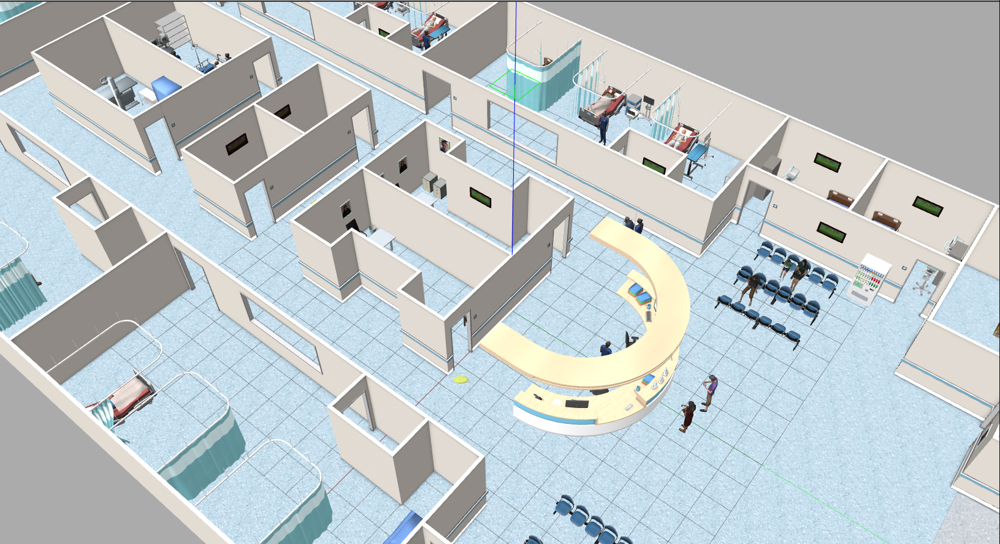
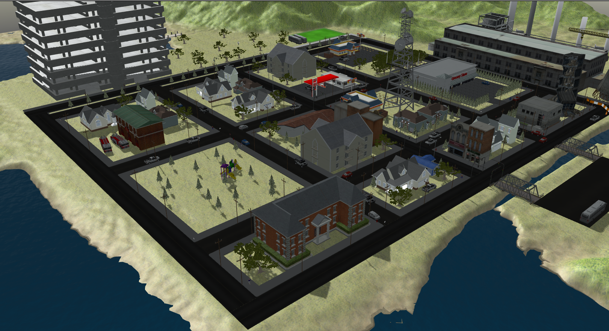
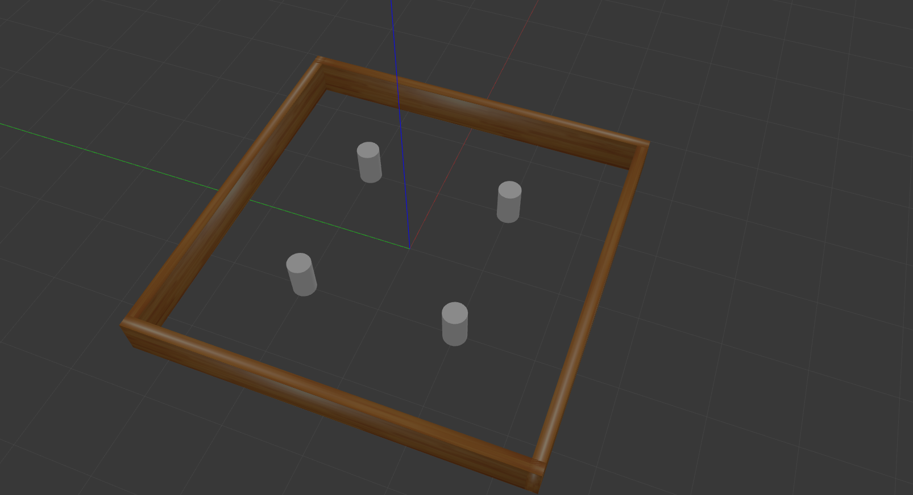

# gazebo_world_ws

This repository contains several Gazebo worlds, which are valuable for testing robots or agents in both indoor and outdoor environments.

## 🌱 Structure 🌱

```
gazebo_world_ws
├── .devcontainer
├── docker
├── figure
├── src
|   ├── aws-robomaker-hospital-world
|   ├── aws-robomaker-small-house-world
|   ├── aws-robomaker-small-warehouse-world
|   ├── citysim
|   ├── gazebo_launch
|   └── turtlebot3_gazebo
├── .gitignore
└── README.md
```

## 🚩 How to use 🚩

```bash=
# Build the workspace
cd /home/ros2-agv-essentials/gazebo_world_ws
colcon build --symlink-install

# Launch the world
# Replace <target world> with the name of the world you wish to launch.
# Available target worlds:
# - aws_hospital
# - aws_small_house
# - aws_warehouse
# - citysim
# - turtlebot3
ros2 launch gazebo_launch <target world>.launch.py
```

> The TurtleBot3 offers multiple worlds to choose from. For more information, you can refer to the launch file located at `turtlebot3.launch.py` in the `gazebo_launch` package.

## ✨ Snapshot ✨

|       World       |                        Snapshot                         |
|:-----------------:|:-------------------------------------------------------:|
|   aws_hospital    |       |
|  aws_small_house  |    |
|   aws_warehouse   |      |
|      citysim      |            |
| turtlebot3_stage3 |  |
| turtlebot3_world  |   |

## 🔍 Integrate the world into another workspace 🔍

Since we've organized the packages neatly, you simply need to copy the `gazebo_launch` package along with the packages containing the desired world into another workspace.
