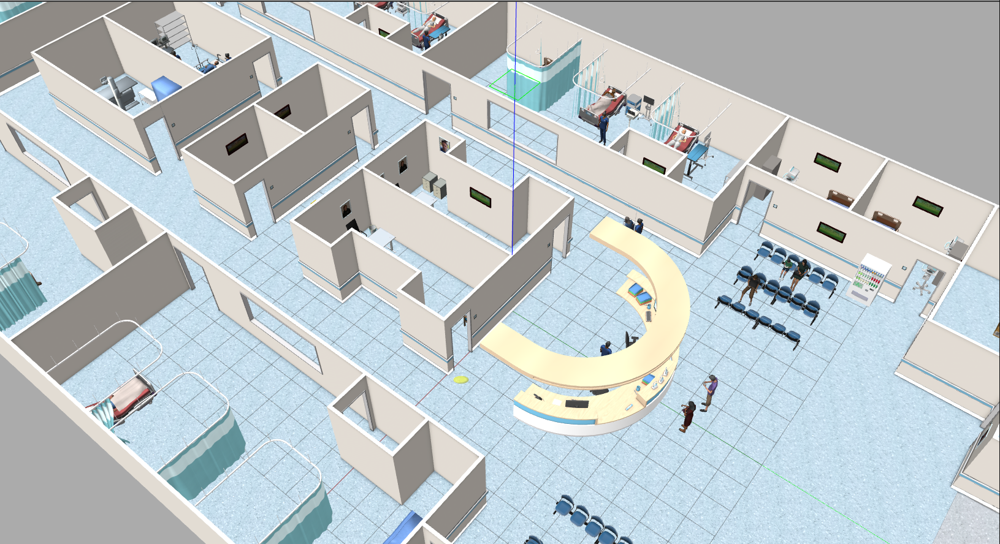
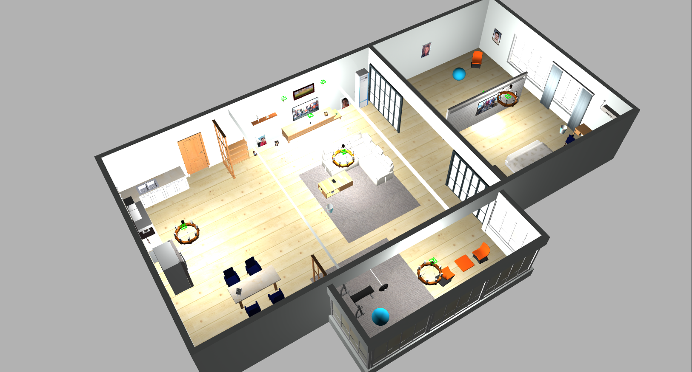
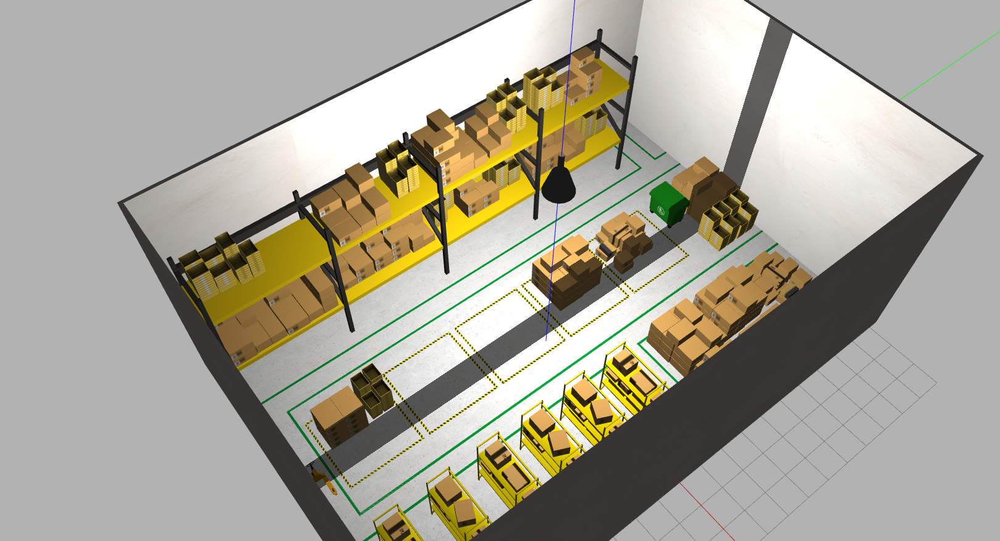
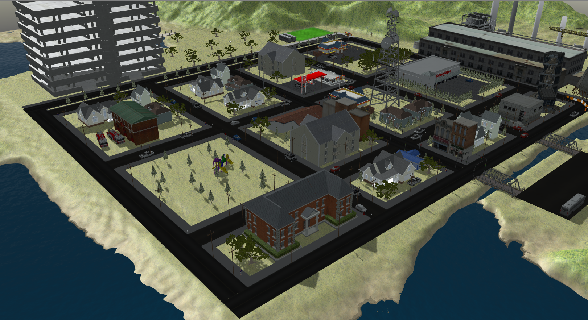
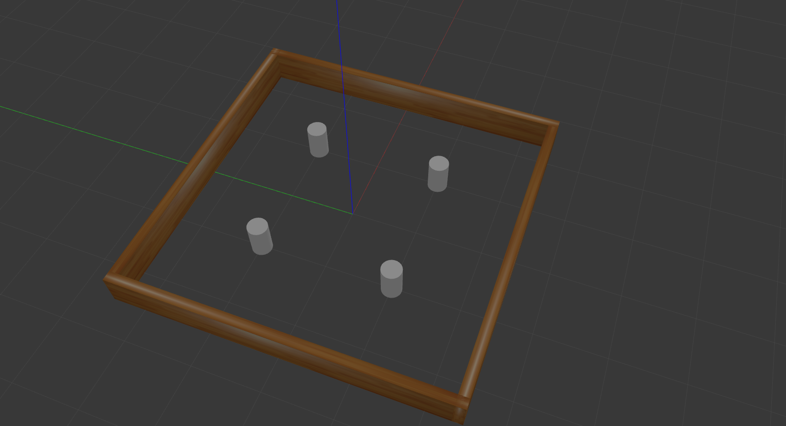
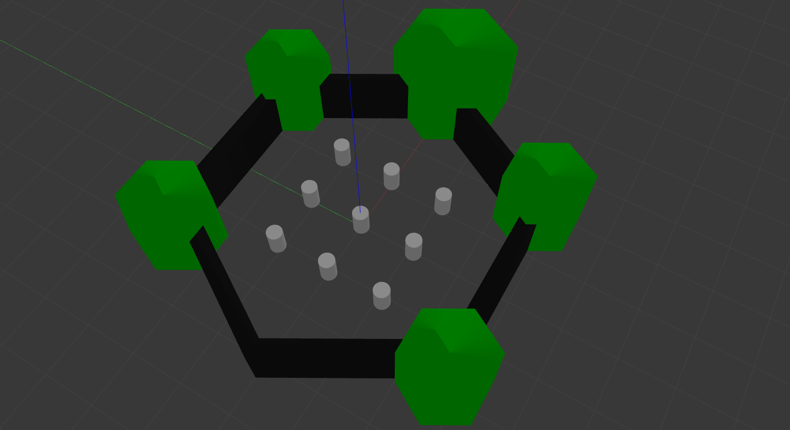

# gazebo_world_ws

This repository contains several Gazebo worlds, which are valuable for testing robots or agents in both indoor and outdoor environments.

## 🌱 Structure 🌱

```
gazebo_world_ws
├── .devcontainer
├── docker
├── figure
├── src
|   ├── aws-robomaker-hospital-world
|   ├── aws-robomaker-small-house-world
|   ├── aws-robomaker-small-warehouse-world
|   ├── citysim
|   ├── gazebo_launch
|   └── turtlebot3_gazebo
├── .gitignore
└── README.md
```

## 🚩 How to use 🚩

### 1. Download the models

Since we won't modify the models, we've removed all of them from the repository and uploaded them to [Google Drive](https://drive.google.com/drive/folders/12Pj0jE_ybQFRqS3Qu-0j2B6zOt68Wco3?usp=sharing). Before proceeding with testing, please ensure you download the models you intend to use.

We offer a script for automatic file downloads, but please note that it may require [setting up the cookie](https://github.com/wkentaro/gdown?tab=readme-ov-file#faq) and could encounter issues such as `Permission Denied`. This issue arises because Google restricts access to a file when there is a concentrated download activity. If you encounter errors, try executing the script multiple times. If the problem persists, you may need to consider downloading the models directly from your web browser.

> Since the tool we used for downloading, `gdown`, can only handle folders containing less than 50 files or folders, you'll notice that some models are split into multiple folders, such as `models_1` and `models_2`. Please download all the models from the folders into the same folder within the repository.

```bash=
# Replace <target model> with the name of the model you wish to download.
# Available targets:
# - all
# - aws-robomaker-hospital-world
# - aws-robomaker-small-house-world
# - aws-robomaker-small-warehouse-world
# - citysim
# - turtlebot3_gazebo

cd gazebo_world_ws/src/gazebo_launch
./scripts/download_model.sh <target model>
```

The download process might take some time. If you wish to download multiple targets simultaneously, you can try initiating downloads in separate terminals. This parallel download approach can significantly expedite the process.

### 2. Build the workspace and launch the world

```bash=
# Build the workspace
cd /home/ros2-agv-essentials/gazebo_world_ws
colcon build --symlink-install

# Launch the world
# Replace <target world> with the name of the world you wish to launch.
# Available target worlds:
# - aws_hospital
# - aws_small_house
# - aws_warehouse
# - citysim
# - turtlebot3
ros2 launch gazebo_launch <target world>.launch.py
```

> The TurtleBot3 offers multiple worlds to choose from. For more information, you can refer to the launch file located at `turtlebot3.launch.py` in the `gazebo_launch` package.

## ✨ Snapshot ✨

|       World       |                        Snapshot                         |
|:-----------------:|:-------------------------------------------------------:|
|   aws_hospital    |       |
|  aws_small_house  |    |
|   aws_warehouse   |      |
|      citysim      |            |
| turtlebot3_stage3 |  |
| turtlebot3_world  |   |

## 🔍 Integrate the world into another workspace 🔍

Since we've organized the packages neatly, you simply need to copy the `gazebo_launch` package along with the packages containing the desired world into another workspace.
