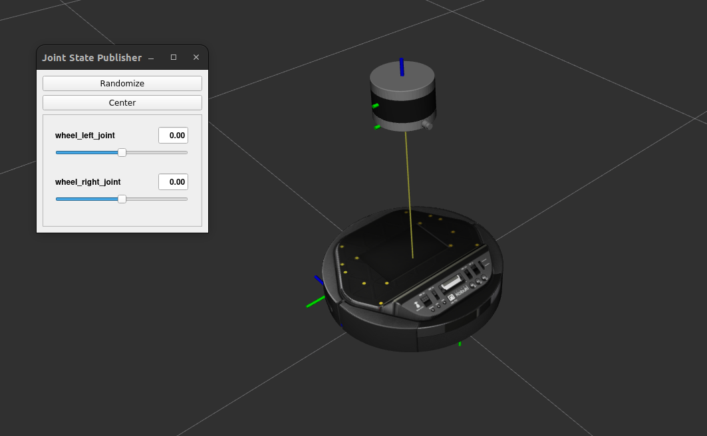
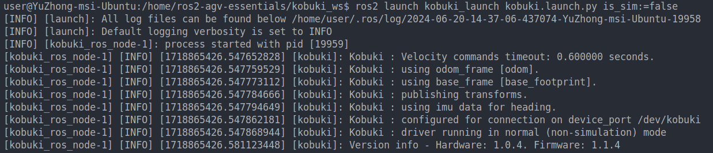
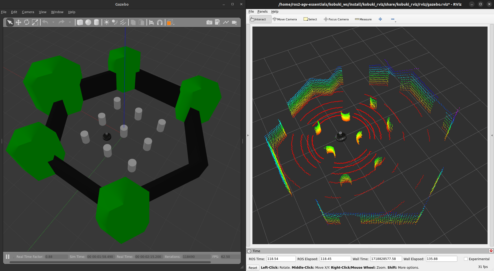
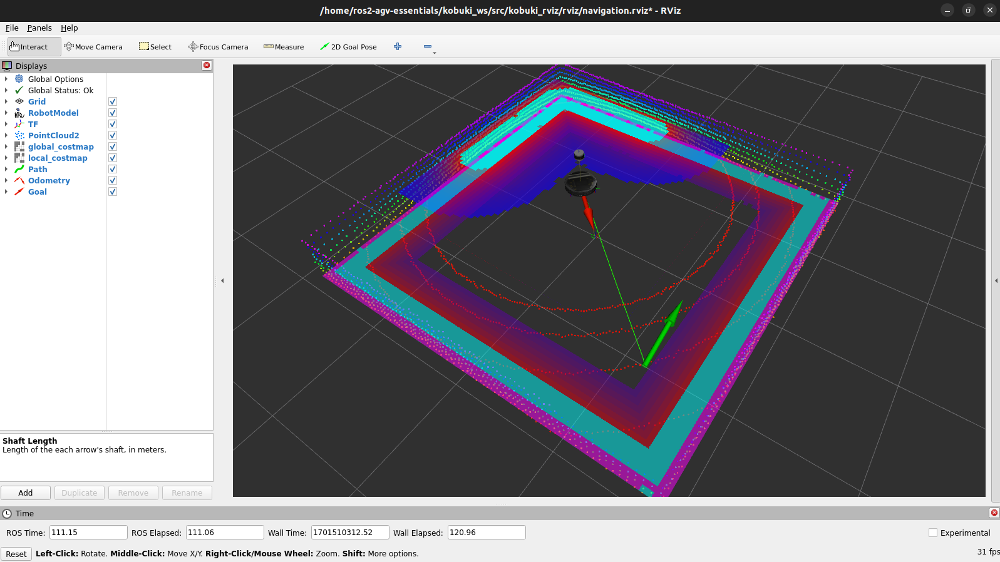

# kobuki_ws

This repository facilitates the quick configuration of simulation environment and real robot driver for Kobuki.

## 🌱 Structure 🌱

Here is the structure of this workspace:

```
kobuki_ws
├── README.md
├── .devcontainer
│   ├── devcontainer.json
│   └── postCreateCommand.sh
├── docker
│   ├── Dockerfile
│   ├── cache
│   └── compose.yaml
├── figure
├── src
│   ├── kobuki_core
│   ├── kobuki_gazebo
│   ├── kobuki_launch
│   ├── kobuki_navigation
│   ├── kobuki_ros
│   │   ├── kobuki_description
│   │   ├── kobuki_keyop
│   │   └── kobuki_node
│   ├── kobuki_rviz
│   └── velodyne_simulator
└── udev_rules
    ├── 60-kobuki.rules
    └── install_udev_rules.sh
```

## ◻️ Introduction ◻️

This repository is primarily based on the [kobuki-base](https://github.com/kobuki-base).  
Below are the main packages for Kobuki:

|      Package       |                                        Introduction                                        |
|:------------------:|:------------------------------------------------------------------------------------------:|
|    kobuki_core     |                               Base configuration for Kobuki                                |
|   kobuki_gazebo    |                                Simulating Kobuki in Gazebo                                 |
|   kobuki_launch    |                        Launch Kobuki in Gazebo or with a real robot                        |
| kobuki_navigation  |                                Navigation setup for Kobuki                                 |
| kobuki_description |                                  Robot description (URDF)                                  |
|    kobuki_keyop    | Similar to [teleop_twist_keyboard](https://github.com/ros2/teleop_twist_keyboard) in ROS 2 |
|    kobuki_node     |                                       Kobuki Driver                                        |
|    kobuki_rviz     |                                 Visualizing data in RViz2                                  |
| velodyne_simulator |                                 Simulating VLP-16 in Gaebo                                 |

## 🚩 Testing 🚩

### Set up udev rule

```bash
cd /home/ros2-agv-essentials/kobuki_ws
./udev_rules/install_udev_rules.sh
```

Follow the command to set up the udev rule. After the setup, you should see a symlink `/dev/kobuki -> /dev/ttyUSB0`.  
If you can't find this link, please ensure that the docker container has access to the Kobuki.  
It might be located at `/dev/ttyUSB1` or another location.

### Building packages

Before attempting any examples, please remember to build the packages first.

```bash
cd /home/ros2-agv-essentials/kobuki_ws
colcon build --symlink-install
```

- The `--symlink-install` flag is optional, adding this flag may provide more convenience.

> After the build process, make sure to source the `install/setup.bash` file.  
> Otherwise, ROS2 will not locate the executable files. You can open a new terminal to accomplish this.

### View the model

```bash
ros2 launch kobuki_rviz view_model_launch.py
```

<div align="center">
    <a href="./">
        
    </a>
</div>

### Launch robot in real world or Gazebo

```bash
ros2 launch kobuki_launch kobuki.launch.py is_sim:=true
```

- `is_sim` : Specify whether to launch the robot in Gazebo.

#### Launch real robot

<div align="center">
    <a href="./">
        
    </a>
</div>

#### Launch robot in Gazebo

<div align="center">
    <a href="./">
        
    </a>
</div>

### Launch navigation2

```bash
ros2 launch kobuki_navigation navigation2.launch.py
```

<div align="center">
    <a href="./">
        
    </a>
</div>
