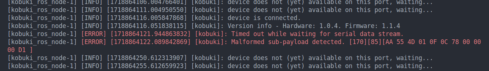

# kobuki_ws

This repository facilitates the quick configuration of the simulation environment and real robot driver for Kobuki.

## ◻️ Introduction ◻️

This repository is primarily based on the [kobuki-base](https://github.com/kobuki-base). Below are the main packages for Kobuki:

|      Package       |                                        Introduction                                        |
|:------------------:|:------------------------------------------------------------------------------------------:|
|   kobuki_control   |                          The localization configuration of Kobuki                          |
|    kobuki_core     |                               Base configuration for Kobuki                                |
|   kobuki_gazebo    |                                Simulating Kobuki in Gazebo                                 |
|   kobuki_launch    |                        Launch Kobuki in Gazebo or with a real robot                        |
| kobuki_navigation  |                                SLAM setup for Kobuki                                       |
| kobuki_description |                                  Robot description (URDF)                                  |
|    kobuki_node     |                                       Kobuki Driver                                        |
|    kobuki_rviz     |                                 Visualizing data in RViz2                                  |
| velodyne_simulator |                                 Simulating VLP-16 in Gazebo                                |

## 🚩 Testing 🚩

### Building packages

> If you only need to bring up the real Kobuki robot, you don't need to compile the workspace. The Kobuki driver is already included in the Docker image. After the Docker image is built, you can directly bring up the robot.

```bash
cd /home/ros2-agv-essentials/kobuki_ws

# For x86_64 architecture
colcon build --symlink-install
# For arm64 architecture
colcon build --symlink-install --packages-ignore velodyne_gazebo_plugins
```

- The `--symlink-install` flag is optional, adding this flag may provide more convenience. See [this post](https://answers.ros.org/question/371822/what-is-the-use-of-symlink-install-in-ros2-colcon-build/) for more info.
- The `--packages-ignore` flag is used to ignore the `velodyne_gazebo_plugins` package. This package will use the `gazebo_ros_pkgs` package, which is not supported in the arm64 architecture.
- Please note that the building process for the embedded system may take a long time and could run out of memory. You can use the flag `--parallel-workers 1` to reduce the number of parallel workers, or you can build the packages on a more powerful machine and then transfer the executable files to the embedded system. For guidance on building the packages on a x86_64 architecture and then transferring the files to an arm64 architecture, refer to the `cross-compilation` section at the end of this README.

After the build process, make sure to source the `install/setup.bash` file. Otherwise, ROS2 will not locate the executable files. You can open a new terminal to accomplish this.

### Visualize the model in RViz

```bash
ros2 launch kobuki_rviz view_model_launch.py
```

<div align="center">
    <a href="./">
        
    </a>
</div>

You can view the published states under `TF > Frames > wheel_left_link` and `TF > Frames > wheel_right_link` in RViz.

### Launch the robot in Gazebo

```bash
ros2 launch kobuki_launch kobuki.launch.py is_sim:=true
```

<div align="center">
    <a href="./">
        
    </a>
</div>

### Launch the robot in the real world

```bash
# Inside the container
cd /home/ros2-agv-essentials/kobuki_ws
./script/kobuki-bringup.sh

# Outside the container
cd /path/to/kobuki_ws/docker
docker compose run kobuki-ws /home/ros2-agv-essentials/kobuki_ws/script/kobuki-bringup.sh
```

If you have successfully connected to the Kobuki, you should hear a sound from it. Otherwise, there may be errors. You can try re-plugging the USB cable, reopening the Kobuki, or even restarting the container.

<div align="center">
    <a href="./">
        
    </a>
</div>

If you encounter an error message like the one below or a similar error in the terminal, please ensure that your USB cable is properly connected to the Kobuki and that the connection is stable. Additionally, if the Kobuki's battery is low, communication failures are more likely to occur. Please charge the Kobuki fully before trying again.

<div align="center">
    <a href="./">
        
    </a>
</div>

To control the Kobuki with a keyboard, you can use the `teleop_twist_keyboard` package.

```bash
# Recommend speed: 
# - Linear 0.1
# - Angular 0.3

# Inside the container
cd /home/ros2-agv-essentials/kobuki_ws
./script/kobuki-teleop.sh

# Outside the container
cd /path/to/kobuki_ws/docker
docker compose run kobuki-ws /home/ros2-agv-essentials/kobuki_ws/script/kobuki-teleop.sh
```

### Launch the demo of SLAM

This demo is based on the [slam_toolbox](https://github.com/SteveMacenski/slam_toolbox) package and only supports the simulation environment.

```bash
ros2 launch kobuki_navigation slam.launch.py
```

<div align="center">
    <a href="./">
        
    </a>
</div>

### Cross-compilation

Since the embedded system may not have enough memory to build the packages, or it may take a long time to build them, you can build the packages on a x86_64 machine and then copy the executable files to the arm64 machine.

First, you need to set up the Docker cross-compilation environment. See [this repo](https://github.com/multiarch/qemu-user-static) and [this website](https://www.stereolabs.com/docs/docker/building-arm-container-on-x86) for more info.

```bash
# Install the QEMU packages
sudo apt-get install qemu binfmt-support qemu-user-static
# This step will execute the registering scripts
docker run --rm --privileged multiarch/qemu-user-static --reset -p yes --credential yes
# Testing the emulation environment
docker run --rm -t arm64v8/ros:humble uname -m
```

Secondly, modify the target platform for the Docker image in `docker/compose.yaml` by uncommenting the two lines below.

```yaml
platforms:
    - "linux/arm64"
```

Next, navigate to the `docker` folder and use the command `docker compose build` to build the Docker image.

Note that the arm64 architecture is emulated by the QEMU, so it may consume a lot of CPU and memory resources. You should not use the `devcontainer` when building the packages for the arm64 architecture on x86_64 architecture, Otherwise, you may encounter some problems such as running out of memory. If you really want to use `devcontainer`, remove all vscode extensions in the `.devcontainer/devcontainer.json` file first.

When the building process ends, use `docker compose up -d` and attach to the container by running `docker attach ros2-kobuki-ws`. After that, we can start building the ROS packages. If you have built the packages for the x86_64 architecture before, remember to delete the `build`, `install`, and `log` folders.

```bash
cd /home/ros2-agv-essentials/kobuki_ws
colcon build --symlink-install --packages-ignore velodyne_gazebo_plugins
```

Once everything is built, we can start copying the files to the target machine (arm64 architecture).  
Please modify the command below to match your settings, such as the IP address.

```bash
# (On Host) 
cd /path/to/kobuki_ws
# Save the Docker image to the file.
docker save j3soon/ros2-kobuki-ws | gzip > kobuki_image.tar.gz
# Copy the file to the target machine.
scp -C kobuki_image.tar ubuntu@192.168.50.100:~/
# Copy the kobuki_ws to the target machine. 
# If the workspace exists on the target machine, you can simply copy the `build` and `install` folders to it.
rsync -aP kobuki_ws ubuntu@192.168.50.100:~/
```

```bash
# (On Remote)
cd ~/
# Decompress the file.
gunzip kobuki_image.tar.gz
# Load the Docker image from the file.
docker load < kobuki_image.tar
# Verify that the Docker image has loaded successfully.
docker images | grep ros2-kobuki-ws
```

If you have completed all the commands above without encountering any errors, you can proceed to launch the robot.  
Refer to the steps above for more information.
