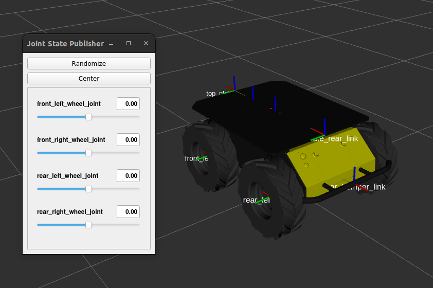
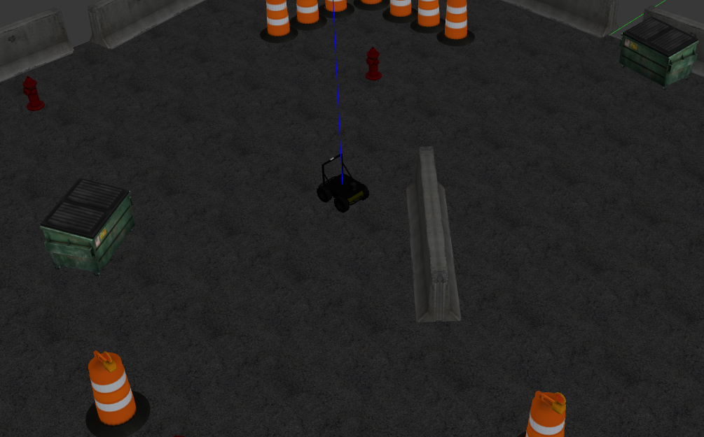
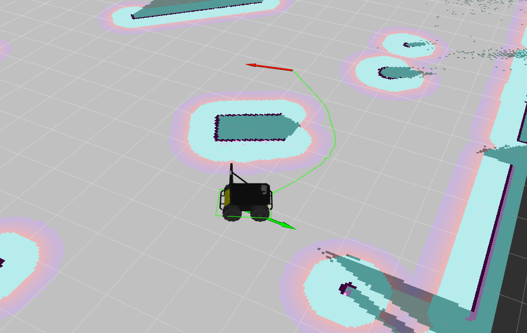

# husky_ws

This repository will help you configure the environment for Husky quickly.

## 🌱 Structure 🌱

Here is the structure of this workspace:

```
husky_ws
├── .devcontainer
├── docker
├── figure
├── install
├── build
├── log
├── script
|   ├── husky-bringup.sh
|   ├── husky-generate.sh
|   └── husky-teleop.sh
├── src
|   ├── husky
|   |   ├── husky_base
|   |   ├── husky_bringup
|   |   ├── husky_control
|   |   └── ...
├── udev_rules
|   ├── 41-clearpath.rules
|   └── install_udev_rules.sh
├── .gitignore
└── README.md
```

> ```build``` / ```install``` / ```log``` folders will appear once you've built the packages.

## ✨ Introduction ✨

This repository has been derived from the Clearpath Husky's repository. [Here](https://github.com/husky/husky/tree/humble-devel) is the original repository.  
However, the original repository was designed for ROS1, and it is in the process of being upgraded to ROS2.

Below are the main packages for Husky:

- husky_base : Base configuration
- husky_control : Control configuration
- husky_description : Robot description (URDF)
- husky_navigation : Navigation configuration
- husky_gazebo : Simulate environment
- husky_viz : Visualize data

## 🚩 Testing 🚩

### Building packages

Before attempting any examples, please remember to build the packages first.  
If you encounter any dependency errors, please use rosdep to resolve them.

```bash
cd /home/ros2-agv-essentials/husky_ws
rosdep update
rosdep install --from-paths src --ignore-src --rosdistro humble -y
colcon build
```

> After the build process, make sure to source the `install/setup.bash` file.  
> Otherwise, ROS2 will not locate the executable files. You can open a new terminal to accomplish this.

### View the model

```bash
ros2 launch husky_viz view_model_launch.py
```

<div align="center">
    <a href="./">
        
    </a>
</div>

### Demonstration of SLAM.

```bash
ros2 launch husky_navigation slam_launch.py
```

> Rendering the model may take some time, so please be patient !

<div align="center">
    <a href="./">
        
        
    </a>
</div>

### Control real robot

> Before you proceed, please ensure that you've plugged the USB adapter of the Husky into the computer and mounted it into the container.

```bash=
# 0. Move to the workspace.
cd /home/ros2-agv-essentials/husky_ws

# 1. Setup udev rules.
./udev_rules/install_udev_rules.sh

# 2. Generate robot configuration files.
./script/husky-generate.sh 

# 3. Source .bashrc or open a new terminal.
source ~/.bashrc

# 4. Bring up the robot.
./script/husky-bringup.sh

# (Optional) Control the robot via keyboard teleoperation.
./script/husky-teleop.sh
```

Once you've set up everything correctly, you'll only need to execute the last step to bring up the robot.
