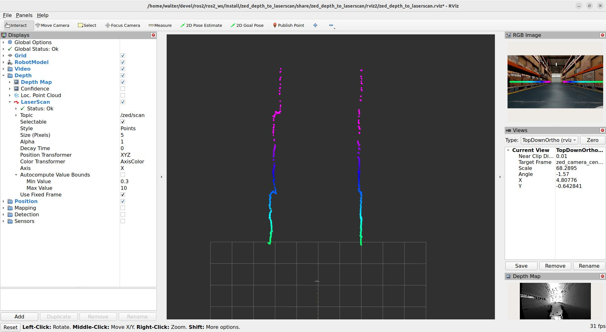

# ZED Depth map to Laser Scan

This example demonstrates how to use [ROS 2 Composition](https://docs.ros.org/en/humble/Concepts/Intermediate/About-Composition.html) to convert the ZED Depth map messages into a virtual laser scan by using the `depthimage_to_laserscan` package.

Usage:

```bash
ros2 launch zed_to_laser_scan zed_to_laser_scan.launch.py  camera_model:=<camera_model>
```

the launch file will start the ZED Wrapper node, the Depth Image to Laser Scan converter node, RVIZ2 for data visualization, and a Robot State Publisher node to broadcast the ZED camera static frames.

You can disable RVIZ2 by using the launch argument `rviz:=false`.

You can also get the list of all the available launch parameters with 

```bash
ros2 launch zed_to_laser_scan zed_to_laser_scan.launch.py -s
```




## The launch file explained

The launch file creates a ROS 2 container to run the two components:

```xml
# ROS 2 Component Container
    container = ComposableNodeContainer(
            name='zed_depth_to_laserscan',
            namespace=camera_name_val,
            package='rclcpp_components',
            executable='component_container',
            composable_node_descriptions=[
                zed_wrapper_component,
                zed_cvt_component
            ],
            output='screen',
    )
```

The `zed_wrapper_component` variable defines the ZED node:

```xml
# ZED Wrapper component
    zed_wrapper_component = ComposableNode(
        package='zed_components',
        namespace=camera_name_val,
        plugin='stereolabs::ZedCamera',
        name=zed_node_name,
        parameters=[
            # YAML files
            config_common_path,  # Common parameters
            config_camera_path,  # Camera related parameters
            # Overriding
            {
                'general.camera_name': camera_name_val,
                'general.camera_model': camera_model_val,
                'general.svo_file': svo_path,
                'general.serial_number': serial_number
            }
        ],
        extra_arguments=[{'use_intra_process_comms': True}]
    )
```

the parameters are loaded from the YAML files defined by the variables `config_common_path` and `config_camera_path`. Note that `camera_name`, `camera_model`, `svo_file`, and `serial_number` are overridden by the launch options, so their values in the YAML files are ignored.

The `zed_cvt_component` variable defines the "Depth Image to Laser Scan" node:

```xml
# Depth to Laser scan component
    zed_cvt_component = ComposableNode(
        package='depthimage_to_laserscan',
        namespace=camera_name_val,
        plugin='depthimage_to_laserscan::DepthImageToLaserScanROS',
        name='depthimage_to_laserscan',
        parameters=[
            config_path_cvt,
            # Overriding
            {
                'output_frame': camera_depth_frame
            }],
        remappings=[
                ('depth', zed_node_name_val + '/depth/depth_registered'),
                ('depth_camera_info', zed_node_name_val + '/depth/camera_info')
            ],
        #extra_arguments=[{'use_intra_process_comms': True}] # Uncomment when supported by the package
    )
```

the parameters are loaded from the YAML files defined by the variable `config_path_cvt`. The parameter `output_frame` is overridden by the value of the variable `camera_depth_frame` initialized above to match the name of the link broadcasted by the ZED node: `camera_depth_frame = camera_name_val + '_left_camera_frame'`.

The topic names `depth` and `depth_camera_info` are remapped to match the topic names published by the ZED node.

## Known issues

Unfortunately, we cannot leverage the Intraprocess Communication behavior and improve data transmission performance with zero-copy because the default QoS setting of the `depthimage_to_laserscan::DepthImageToLaserScanROS` component is not compatible [see [issue](https://github.com/ros-perception/depthimage_to_laserscan/issues/75)]. If this will be fixed in the future you can uncomment the line `#extra_arguments=[{'use_intra_process_comms': True}] # Uncomment when supported by the package`.
